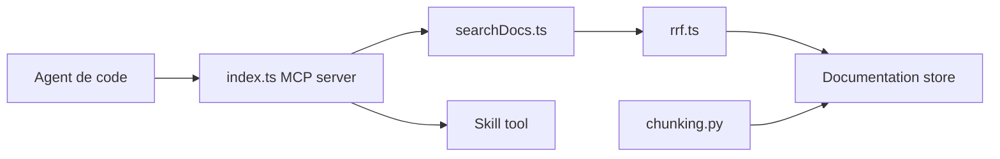

# timescale/pg-aiguide

> Compétences et recherche documentaire PostgreSQL pour que les agents de code écrivent de meilleurs schémas SQL.

## Le problème
Les assistants génèrent du Postgres daté, sans contraintes ni index adaptés.

## Ce que ça fait vraiment
Fournit des Skills de bonnes pratiques (schéma, index, types, intégrité, nommage, performance) et un serveur MCP public avec `search_docs` : recherche sémantique et BM25 dans les manuels PostgreSQL (par version), TimescaleDB et PostGIS, et `view_skill`. L'exemple de démo annonce 4× plus de contraintes et 55 % d'index en plus. L'ingestion scrape, découpe et indexe les docs.

## Comment c'est branché


## Essayer
```bash
npx skills add timescale/pg-aiguide --skill postgres
claude plugin marketplace add timescale/pg-aiguide
claude plugin install pg@aiguide
```

## Coût et pièges
Gratuit ; le serveur MCP public (mcp.tigerdata.com) est hébergé par TigerData : tes requêtes y transitent. Les Skills seuls fonctionnent sans lui.

## Ce que ce n'est pas
Pas un outil de base de données : il ne s'exécute pas sur ta base. Les chiffres de la démo viennent d'un seul test.

## Alternatives
Aucune alternative nommée dans le README.

## Pour toi
À adopter : installer les Skills coûte une commande et améliore les schémas générés par tes agents ; le MCP public reste optionnel.

