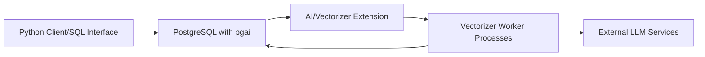

# timescale/pgai

> Bibliothèque Python qui synchronise automatiquement des embeddings dans PostgreSQL pour le RAG.

## Le problème
Garder des embeddings à jour quand les données changent demande files, workers et gestion des pannes de l'API d'embedding.

## Ce que ça fait vraiment
`ai.create_vectorizer()` déclare en SQL un pipeline : chargement (colonne ou fichier S3), parsing, découpage, formatage, embedding.
Des workers sans état traitent la file et écrivent les embeddings ; l'écriture applicative n'en dépend pas.
Recherche via pgvector / pgvectorscale ; « Semantic Catalog » pour le text-to-SQL.

## Comment c'est branché


## Essayer
```bash
pip install pgai
pgai install -d <database-url>
pip install "pgai[vectorizer-worker]"
```

## Coût et pièges
Clé du fournisseur d'embedding à ta charge (OpenAI dans le quickstart) ; un worker à faire tourner hors Timescale Cloud.

## Ce que ce n'est pas
Plus maintenu depuis février 2026, dépôt archivé : aucun correctif à attendre.

## Alternatives
Aucune alternative nommée dans le README (pgvector et pgvectorscale en sont des dépendances).

## Pour toi
À ignorer pour un nouveau projet : l'idée du vectoriseur déclaratif est bonne, mais bâtir un RAG sur un projet archivé est une dette assurée.
