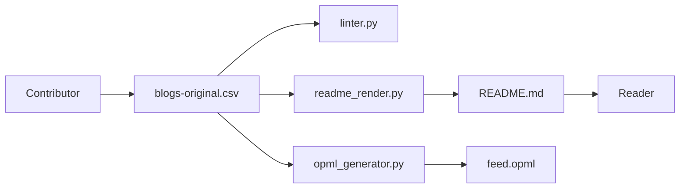

# timqian/chinese-independent-blogs

> Annuaire collaboratif de blogs personnels chinois, avec flux RSS, pour lecteurs et curieux.

## Le problème
Les blogs indépendants chinois sont éclipsés par les plateformes (comptes publics, Zhihu, Weibo) et difficiles à découvrir. Sans liste, un bon blog personnel reste invisible.

## Ce que ça fait vraiment
Un tableau de plus de mille blogs : lien du flux RSS, présentation, adresse, étiquettes (programmation, sécurité, IA, vie quotidienne…). Les ajouts se font par PR sur un CSV ; le README et un fichier OPML sont générés par des scripts. Un indépendant = domaine propre et contenu original de l'auteur.

## Comment c'est branché


## Essayer
```bash
# Aucune commande d'installation documentée.
# Contribuer : ajouter une ligne à ./blogs-original.csv (nom, URL, RSS, tags), puis ouvrir une PR.
```

## Coût et pièges
Gratuit, rien à installer. Contenu quasi entièrement en chinois ; la qualité et la fraîcheur des blogs listés varient.

## Ce que ce n'est pas
Ni un agrégateur ni un lecteur RSS : le dépôt n'héberge aucun contenu. Le README évoque seulement l'idée d'un futur outil de découverte. Les étiquettes sont déclaratives, non vérifiées.

## Alternatives
Aucune alternative nommée dans le README (il cite seulement des générateurs de blogs : Hexo, Hugo, Jekyll…).

## Pour toi
À garder en signet si tu lis le chinois et veux alimenter un lecteur RSS en blogs techniques (ML, systèmes) ; sinon sans utilité directe pour un profil data/MLOps.

