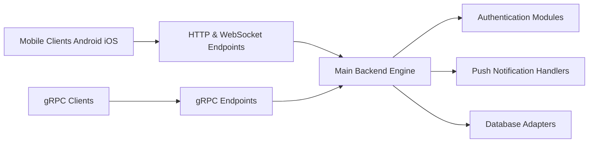

# tinode/chat

> Serveur de messagerie instantanée en Go, alternative ouverte à WhatsApp/Telegram.

## Le problème
Les messageries restent des jardins clos incompatibles ; XMPP n'a pas tenu sa promesse de fédération.

## Ce que ça fait vraiment
Serveur Go exposant WebSocket, long polling et gRPC ; clients web, Android, iOS, CLI Python.
Modules d'authentification (anon, basic, token, REST), notifications push, médias local ou S3.
Adaptateurs de base MySQL, PostgreSQL, MongoDB, RethinkDB ; bac à sable public.

## Comment c'est branché

## Essayer
Aucune commande documentée dans le README (renvoi vers les instructions d'installation).

## Coût et pièges
Gratuit auto-hébergé ; support payant proposé. Qualité « beta » selon le README.

## Ce que ce n'est pas
Pas compatible XMPP, pas un remplaçant de Slack ; fédération seulement planifiée.

## Alternatives
Aucune alternative nommée dans le README.

## Pour toi
À ignorer : messagerie généraliste hors du périmètre data/ML.
