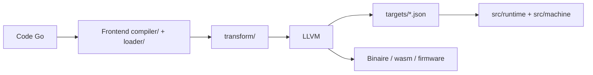

# tinygo-org/tinygo

> Compilateur Go basé sur LLVM pour microcontrôleurs, WebAssembly et petits binaires.

## Le problème
Le compilateur Go standard produit des binaires trop gros et ne cible pas les microcontrôleurs.

## Ce que ça fait vraiment
Il réutilise les bibliothèques de l'outillage Go et LLVM pour compiler du Go vers plus de 150 cartes (Arduino Uno, XIAO ESP32S3, etc.), vers WebAssembly/WASI, ou vers Linux, macOS et Windows. Objectifs : binaires très petits, bon support CGo, plupart de la bibliothèque standard. Il ne vise ni la vitesse de `gc` ni la compilation de tout programme Go.

## Comment c'est branché


## Essayer
```bash
tinygo flash -target arduino-uno examples/blinky1
tinygo build -buildmode=c-shared -o add.wasm -target=wasip1 add.go
```

## Coût et pièges
Gratuit ; contribution financière demandée via OpenCollective. La licence est présente mais non identifiée automatiquement : la lire avant tout usage commercial.

## Ce que ce n'est pas
Ce n'est pas un remplaçant de Go : certains programmes ne compilent pas, et les goroutines ne sont pas optimisées pour des masses.

## Alternatives
Le README mentionne emgo, qui abandonne le modèle mémoire de Go.

## Pour toi
À ignorer sauf edge computing : pertinent pour du Go embarqué ou du WASM léger, pas pour l'entraînement ni l'inférence de modèles.

