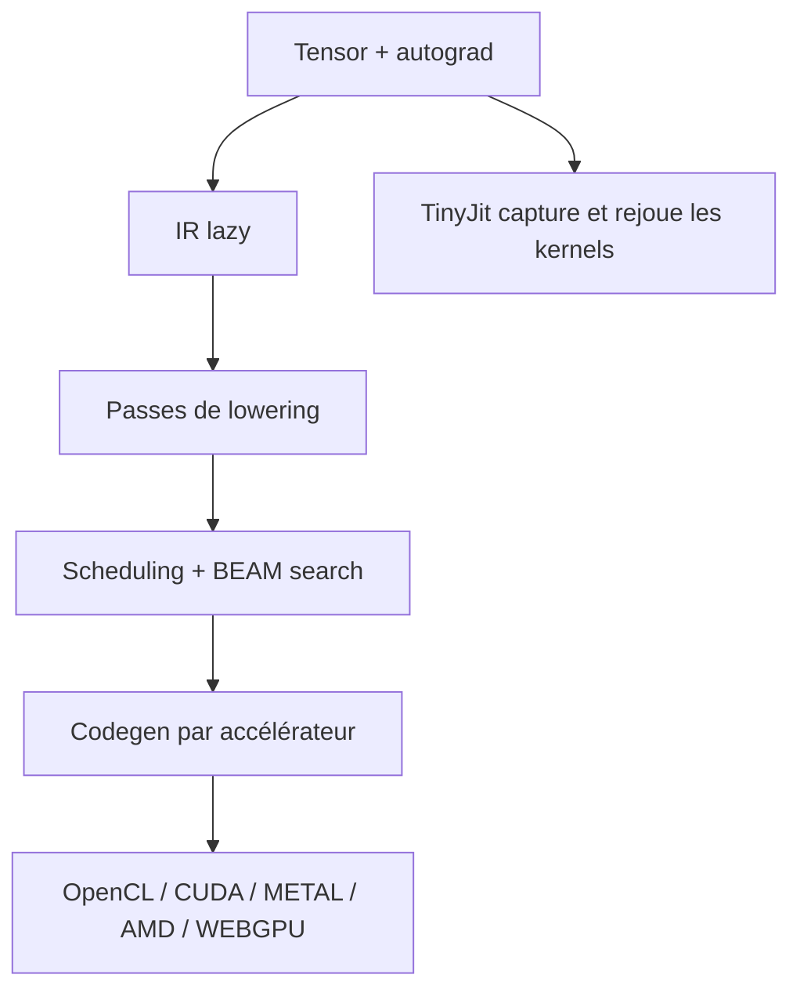

# tinygrad/tinygrad

> Pile d'apprentissage profond minimale : tenseurs, autograd, IR et compilateur, tous lisibles.

## Le problème
Comprendre comment un framework fusionne des kernels demande de lire des centaines de milliers de lignes de C++.
Ajouter un accélérateur à PyTorch n'est pas un projet de week-end.

## Ce que ça fait vraiment
Pile complète : bibliothèque de tenseurs avec autograd, IR et compilateur qui fusionnent et abaissent les kernels, JIT et exécution par graphe, modules `nn`/`optim`/`datasets` pour entraîner réellement.
Laziness : une expression `reshape`/`*`/`sum` se fusionne en un seul kernel, visible avec `DEBUG=3`, et le code généré avec `DEBUG=4`.
Autodiff sur IR comme JAX, passes de lowering, scheduling et recherche BEAM sur les kernels comme TVM, mais avec le front-end en plus.
Accélérateurs supportés : OpenCL, CPU, METAL, CUDA, AMD, NV, QCOM, WEBGPU ; en ajouter un demande environ 25 opérations de bas niveau.

## Comment c'est branché


## Essayer
```sh
git clone https://github.com/tinygrad/tinygrad.git
cd tinygrad
python3 -m pip install -e .
DEBUG=3 python3 -c "from tinygrad import Tensor; N = 1024; a, b = Tensor.empty(N, N), Tensor.empty(N, N); (a.reshape(N, 1, N) * b.T.reshape(1, N, N)).sum(axis=2).realize()"
python3 -m pytest test/
```

## Coût et pièges
Gratuit. L'installation recommandée est depuis les sources, pas depuis PyPI : `pip install -e .` après clone.
Pas de `vmap`/`pmap` complets : si vos transformations fonctionnelles en dépendent, ce n'est pas le bon outil.

## Ce que ce n'est pas
Ce n'est pas un remplaçant de PyTorch en production : le README le positionne « entre PyTorch et micrograd », avec l'intelligibilité comme objectif.
Ce n'est pas un framework à fonctionnalités complètes : moins de transformations que JAX, assumé.
Ce n'est pas un projet de fondation : maintenu par tiny corp.

## Alternatives
- PyTorch — API eager équivalente et écosystème complet, mais compilateur et IR opaques.
- JAX — mêmes idées d'autodiff sur IR, avec `vmap`/`pmap` que tinygrad n'a pas.
- TVM — compilateur et scheduling comparables, sans le front-end tenseurs/nn/optim.

## Pour toi
À lire plus qu'à déployer : c'est le meilleur moyen de comprendre ce qu'un compilateur ML fait vraiment.
