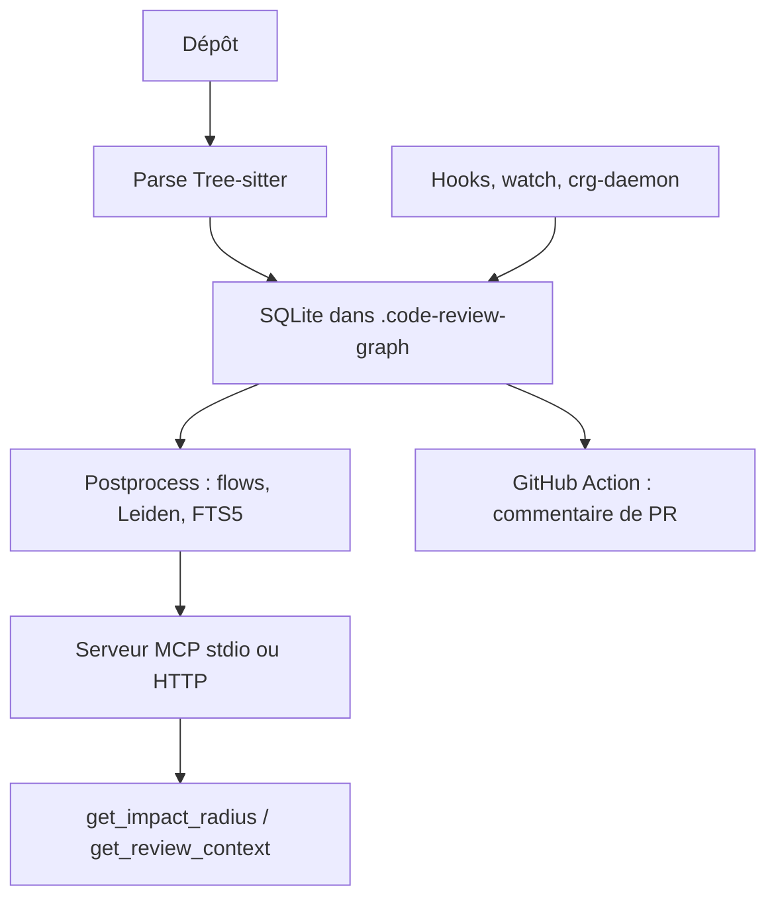

# tirth8205/code-review-graph

> Graphe de code local servi en MCP, pour donner à un agent le contexte exact d'un changement.

## Le problème
Un agent qui revoit un diff relit de larges pans du dépôt pour retrouver qui appelle quoi.
Le coût en tokens explose et la revue rate quand même les dépendances indirectes.

## Ce que ça fait vraiment
Parse le dépôt en AST avec Tree-sitter et le stocke en graphe de nœuds (fonctions, classes, imports) et d'arêtes (appels, héritage, couverture de tests), dans un unique fichier SQLite sous `.code-review-graph/`.
Blast-radius : quand un fichier change, le graphe trace appelants, dépendants et tests concernés, et l'agent ne lit que ceux-là.
Trente outils MCP (contexte minimal, rayon d'impact, traversée BFS/DFS budgétée en tokens, recherche sémantique, communautés Leiden, flux d'exécution, nœuds hubs et ponts, lacunes de connaissance, refactoring, wiki) et cinq prompts de workflow.
Couverture large de langages, langages personnalisés via `.code-review-graph/languages.toml`, mises à jour incrémentales par hooks ou daemon multi-dépôts, et une GitHub Action qui poste un commentaire de PR scoré par risque.

## Comment c'est branché


## Essayer
```bash
pip install code-review-graph
code-review-graph install
code-review-graph build
code-review-graph detect-changes --brief --base main
code-review-graph serve
```

## Coût et pièges
Gratuit, tout local : aucun code n'est envoyé à un service externe, y compris dans l'Action GitHub.
Les exports JSON contiennent des chemins absolus et des métadonnées de structure : à inspecter avant publication.

## Ce que ce n'est pas
Ce n'est pas un gain garanti : sur un changement trivial d'un seul fichier, le contexte graphe peut dépasser une lecture directe, le README le dit.
Ce n'est pas un système de mesure irréprochable : le rappel de 1,0 en analyse d'impact est circulaire (la vérité terrain vient du graphe lui-même), et le mode co-change ne produit encore aucune mesure exploitable.
La détection de flux est surtout solide en Python et PHP/Laravel ; JavaScript et Go restent faibles. Le README fourni est tronqué à la section des groupes de dépendances optionnels.

## Alternatives
Aucune alternative n'est nommée dans le README.

## Pour toi
Idée à retenir même si tu ne l'adoptes pas : indexer le code en graphe pour borner ce que l'agent lit.
