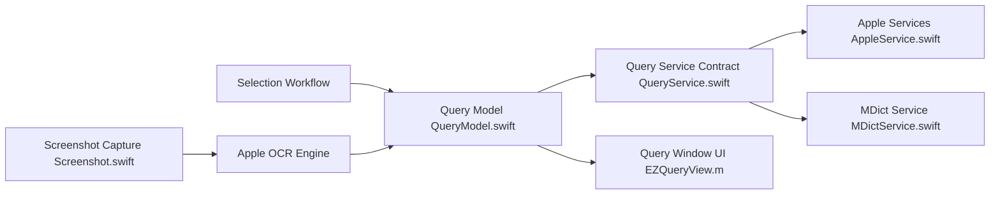

# tisfeng/Easydict

> Application macOS de dictionnaire et traduction, interrogeant plusieurs services dont des LLM.

## Le problème
Traduire un texte sélectionné ou une capture d'écran oblige à jongler entre plusieurs sites et apps.

## Ce que ça fait vraiment
Traduction par saisie, sélection à la souris, raccourci ou capture OCR (Vision d'Apple).
Interroge en parallèle 20+ services : Apple Dictionary, MDict, DeepL, Google, OpenAI, Gemini, Claude, Ollama, Claude Code, Codex CLI.
Serveur HTTP local Vapor exposant les requêtes.
Code Swift/Objective-C, configuration centralisée des clés par service.

## Comment c'est branché


## Essayer
```bash
brew install --cask easydict
```

## Coût et pièges
Gratuit ; les services IA demandent tes clés. macOS 13+ uniquement.

## Ce que ce n'est pas
Pas une API de traduction à intégrer dans un pipeline ; outil de bureau. Mainteneur seul, tri des issues le week-end.

## Alternatives
Aucune alternative nommée dans le README.

## Pour toi
À ignorer pour le travail data/ML : outil de confort macOS, sans usage dans un pipeline.
