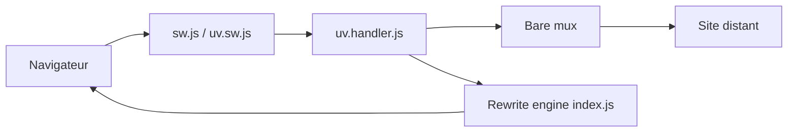

# titaniumnetwork-dev/Ultraviolet

> Proxy web côté navigateur, basé sur un service worker, aujourd'hui supplanté par Scramjet.

## Le problème
Accéder à un site distant à travers un intermédiaire, par exemple pour contourner une censure ou isoler la navigation, demande de réécrire les pages et leurs requêtes côté client.

## Ce que ça fait vraiment
- Un service worker (`sw.js`, `uv.sw.js`) intercepte les requêtes HTTP du navigateur, suivant les spécifications TompHTTP.
- Un moteur de réécriture transforme HTML, CSS, JavaScript, URL et cookies (`codecs.js`) avant de renvoyer le contenu.
- Une couche cliente adapte DOM, stockage, workers, location et historique ; le transport passe par bare-mux (client Bare interchangeable depuis la v3).
- Utilisé par plusieurs projets tiers listés dans le README. Le dépôt n'est plus vraiment maintenu.

## Comment c'est branché


## Essayer
```bash
# Ce dépôt se construit mais ne se déploie pas ; voir Ultraviolet-App pour une installation complète.
# Ancienne version non supportée :
npm install @titaniumnetwork-dev/ultraviolet@1
```

## Coût et pièges
Gratuit, Node requis. Aucun déploiement direct depuis ce dépôt. Un avertissement du README signale qu'il n'est plus maintenu et qu'il faut éviter d'ouvrir des issues.

## Ce que ce n'est pas
Ce n'est pas un outil clé en main ni maintenu. Un proxy de ce type peut servir à contourner des filtrages (réseaux d'entreprise ou scolaires) : l'usage doit respecter les règles du réseau et la loi locale. Licence AGPL-3.0.

## Alternatives
Scramjet, qui l'a remplacé selon le README.

## Pour toi
Ignorer : le projet est supplanté par Scramjet et n'a aucun lien avec un travail data/IA/MLOps.

