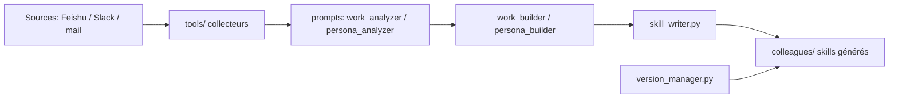

# titanwings/colleague-skill

> Skill d'agent qui distille les messages et documents d'une personne en profil réutilisable (Distilly, ex-Colleague Skill).

## Le problème
Quand un collègue part, son savoir-faire et sa manière de décider disparaissent avec lui.

## Ce que ça fait vraiment
Distilly est un skill installé dans un agent hôte (Claude Code, Codex, OpenCode, etc.). Il collecte des sources (Feishu, DingTalk, Slack, e-mail, PDF, captures, exports), les analyse avec des prompts, puis produit un « Person Profile » empaqueté en skill : travail + personnalité pour un collègue, motifs relationnels, ou modèles mentaux pour une personnalité publique. Les mises à jour s'ajoutent sans écraser, avec archivage et retour arrière.

## Comment c'est branché


## Essayer
```bash
git clone https://github.com/titanwings/distilly <DISTILLY_SKILL_DIR>
```
Puis, dans l'agent : « Use Distilly to create a Person Profile for … ».

## Coût et pièges
Jetons de l'agent hôte à ta charge. La collecte Feishu demande d'ajouter un bot aux groupes. Distiller la vie privée d'un tiers (collègue, ex, proche) pose un enjeu de consentement et de confidentialité que le README ne traite pas.

## Ce que ce n'est pas
Pas un clone de la personne : le README dit lui-même ne pas prétendre la copier. Version « démo » d'après le README.

## Alternatives
Le README cite alchaincyf/karpathy-skill dont un cas est adapté.

## Pour toi
À surveiller : l'idée de skill généré depuis des sources est instructive pour un ingénieur IA, mais évite de l'appliquer à des données personnelles sans cadre clair.
