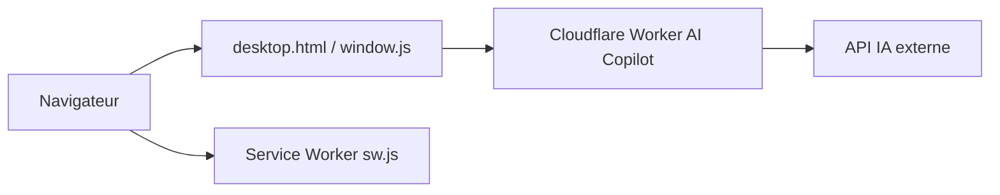

# tjy-gitnub/win12

> Ancien dépôt d'un simulateur web de « Windows 12 », déplacé vers win12-online/win12.

## Le problème
Le README ne contient qu'un avertissement (en chinois) : le dépôt a été transféré à `win12-online/win12`, et ne plus y ouvrir de PR ni d'issue.

## Ce que ça fait vraiment
D'après le code : PWA front-end en HTML, CSS et JavaScript simulant un bureau (démarrage, fenêtres, applications), avec service worker hors-ligne et un « AI Copilot » via un Cloudflare Worker relayant une API d'IA externe.

## Comment c'est branché

## Essayer
Aucune commande documentée ; le README renvoie vers `win12-online/win12`.

## Coût et pièges
Licence EPL-2.0. La fonction Copilot dépend d'un Worker et d'une API externes, dont le coût n'est pas documenté.

## Ce que ce n'est pas
Pas le dépôt actif, et pas un vrai système d'exploitation.

## Alternatives
- win12-online/win12 : dépôt actuel indiqué par le README.

## Pour toi
Ignorer : copie déplacée d'une démo d'interface web, sans intérêt pour un travail data, IA ou MLOps.

