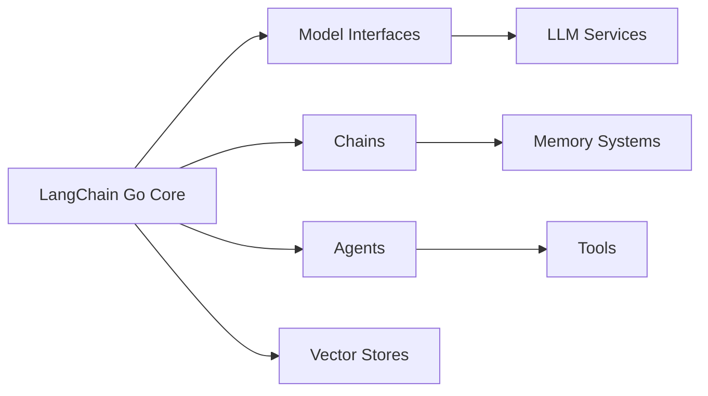

# tmc/langchaingo

> Portage Go de LangChain pour assembler des applications LLM (modèles, chaînes, agents, vector stores).

## Le problème
L'écosystème LangChain est Python/JS ; une équipe Go doit réécrire les briques d'intégration LLM elle-même.

## Ce que ça fait vraiment
Bibliothèque Go avec interfaces de modèles (`llms/openai`, Gemini, Ollama cités dans les billets), chaînes, agents, mémoire, embeddings, vector stores, outils, loaders de documents, text splitters, prompts et parsers de sortie. Le README ne montre qu'un exemple : une complétion OpenAI en une fonction. Le reste renvoie au site de doc et au dossier `./examples`.

## Comment c'est branché


## Essayer
```bash
go run .
```
(Le README ne documente aucune commande d'installation ; il suppose un module Go qui importe `github.com/tmc/langchaingo`.)

## Coût et pièges
Gratuit ; la clé du fournisseur LLM choisi reste à ta charge. 415 issues ouvertes pour un projet porté par un compte personnel : vérifier le suivi avant de s'engager.

## Ce que ce n'est pas
Pas un produit officiel de LangChain Inc. ni un portage à parité complète : le README ne détaille pas la couverture fonctionnelle.

## Alternatives
Aucune alternative nommée dans le README.

## Pour toi
À surveiller seulement si tu dois servir du LLM depuis un backend Go ; pour du travail data/IA en Python, cela n'apporte rien, et un mainteneur unique avec 415 issues invite à la prudence.
