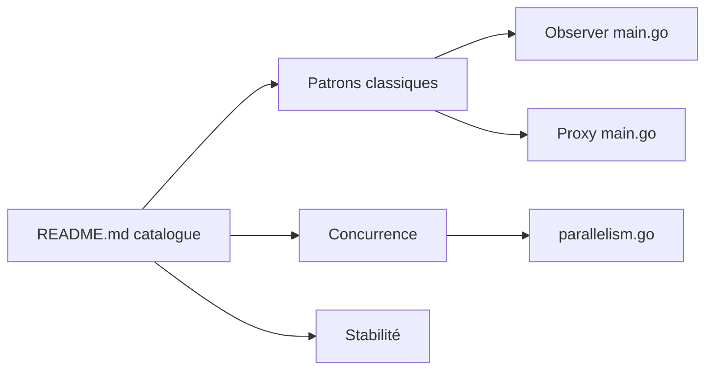

# tmrts/go-patterns

> Collection de patrons de conception et d'application idiomatiques en Go, pour développeurs Go qui apprennent.

## Le problème
Les patrons classiques sont décrits pour Java ou C++ ; leur forme idiomatique en Go n'est pas évidente.

## Ce que ça fait vraiment
Un catalogue en tableaux (créationnels, structurels, comportementaux, synchronisation, concurrence, messagerie, stabilité, profilage, idiomes, anti-patrons) avec un statut ✔ ou ✘ par patron. Beaucoup restent à écrire (✘). Des exemples Go exécutables existent pour Observer, Proxy, Parallelism et Bounded Parallelism.

## Comment c'est branché

## Essayer
Aucune commande documentée : on lit le catalogue et les exemples.

## Coût et pièges
Gratuit. Dernier push en mai 2024, et une majorité de patrons non documentés.

## Ce que ce n'est pas
Pas une bibliothèque réutilisable : ce sont des exemples à lire. Le catalogue est incomplet.

## Alternatives
Aucune alternative nommée dans le README.

## Pour toi
Surveiller : utile pour apprendre les motifs de concurrence Go ; couverture partielle et peu mise à jour.

