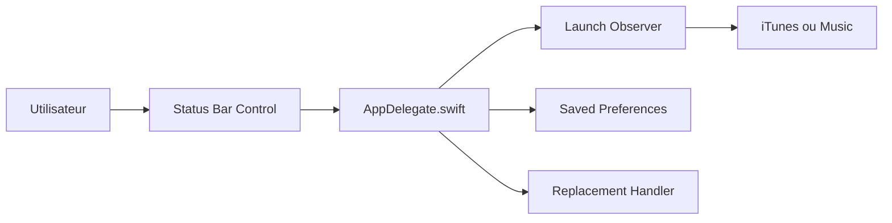

# tombonez/noTunes

> Petite application macOS qui empêche iTunes ou Apple Music de se lancer.

## Le problème
Sous macOS, iTunes ou Music se lance tout seul, par exemple à la reconnexion d'un casque Bluetooth.

## Ce que ça fait vraiment
Application de barre de menus : au démarrage elle termine les instances en cours d'iTunes/Music et observe les lancements suivants. Un clic gauche sur l'icône active ou désactive le blocage. Un réglage `replacement` lance à la place une autre application ou une URL via `open`.

## Comment c'est branché


## Essayer
```bash
brew install --cask notunes
defaults write digital.twisted.noTunes replacement /Applications/YOUR_MUSIC_APP.app
defaults delete digital.twisted.noTunes replacement
```

## Coût et pièges
Gratuit. macOS uniquement. Pour réafficher l'icône masquée : `defaults delete digital.twisted.noTunes` puis relancer. Dernier push en août 2024.

## Ce que ce n'est pas
Pas un lecteur ni un gestionnaire de musique : il ne fait que bloquer un lancement.

## Alternatives
Aucune alternative nommée dans le README.

## Pour toi
Ignorer : utilitaire macOS de confort, sans rapport avec les données, l'IA ou le MLOps.

