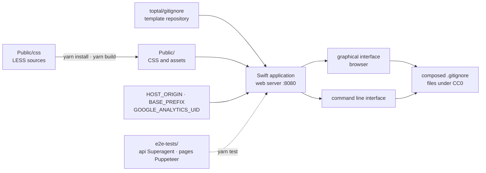

# toptal/gitignore.io

> **The source code of the web service that composes `.gitignore` files, for anyone who wants to self-host it.**

## The problem

Writing a `.gitignore` by hand means remembering everything your operating system, editor, IDE and
language leave behind — and you always forget half of it, until the day a `.DS_Store`, a
`node_modules` directory or a local config file ends up in a commit. The public service already
exists on the web; what is missing, when you work behind a closed network or want an internal
instance, is the ability to run it yourself.

## What it actually does

This repository holds the code of the `.gitignore.io` site, described in the README as *a web
service designed to help you create .gitignore files for your Git repositories*. The site offers
two routes to the same result: a graphical method and a command line method, both parameterised by
operating system, programming language or IDE.

The important point is what the repository does **not** contain: the templates themselves. The
README points to a second repository, `toptal/gitignore`, as the source of the templates. What
lives here is the application — written in Swift according to the badges, served on port 8080,
with LESS stylesheets under `Public/css` compiled by `yarn build`, and end-to-end tests under
`e2e-tests` (API with Superagent, pages with Puppeteer).

Three environment variables, all optional, drive the deployment: `HOST_ORIGIN` (the origin of the
web server, which falls back to `https://www.toptal.com`), `BASE_PREFIX` (to host under a
subdirectory) and `GOOGLE_ANALYTICS_UID` (user ID for the Google Tag Manager snippet).

Files generated by the public service are placed under CC0, a mention kept distinct from the
licence of the code itself.

## How it is wired



No code-derived diagram exists for this repository: this schema is reconstructed from the README
alone, and therefore uses only the paths it names (`Public/css`, `Public`, `Resources`,
`e2e-tests/api`, `e2e-tests/pages`). In development mode, `Public` and `Resources` are mounted as
Docker volumes.

## Trying it

```
docker-compose up --build
```

For development, the README gives two separate steps:

```
docker-compose -f ./docker-compose-dev.yml build
```
```
docker-compose -f ./docker-compose-dev.yml up
```

The web server then listens on `http://localhost:8080`. For the stylesheets and the end-to-end
tests:

```
yarn install
yarn build

docker-compose up --build --detach
yarn gitupdate
yarn install
yarn build
yarn test
docker-compose stop
```

## Cost and pitfalls

- **Docker is the only documented route.** The README describes no direct Swift build: the single
  procedure given goes through `docker-compose`. No Docker, no instructions.
- **Node and Yarn at precise versions** for the tests: the README requires Node.js 12.9 or above,
  and Yarn 1.15.2 or 1.17.3 — two named versions, not an open bound. On a recent machine, that is
  the first thing to install alongside.
- **Optional but wired-in telemetry**: `GOOGLE_ANALYTICS_UID` injects a Google Tag Manager
  snippet. Left empty it should send nothing, but the snippet code sits in the application.
- **Dependency on a third-party repository**: templates come from `toptal/gitignore`, and
  `yarn gitupdate` appears in the test procedure — a self-hosted instance is only as current as
  that source.
- **`HOST_ORIGIN` falls back to `https://www.toptal.com`**: without explicit configuration, the
  instance presents itself under the publisher's origin. To be set before any internal use.
- **Age signals in the README**: a Swift 4.1 badge, Travis CI, Yarn 1.x. Nothing indicates a
  recent refresh of the build chain.
- On the billing side, nothing to pay: MIT licence per the catalogue, generated files under CC0.

## What it is not

- **It is not the collection of `.gitignore` templates.** That is the main misunderstanding:
  anyone looking for the per-language templates should go to `toptal/gitignore`, which the README
  names explicitly as the source. Here there is only the service that assembles them.
- **It is not a command line tool to install.** The README speaks of a "command line method"
  offered *by the site* — not a local binary, and no client installation is documented.
- **It is not needed by most people**: the public service is online and free. This repository only
  matters if you want your own instance — closed network, internal policy, house templates.
- **It is not a linter or a repository cleaner**: it composes a file at the start; it does not
  detect files already tracked by mistake, nor scrub a history.

## Alternatives

| | When to prefer it |
|---|---|
| **toptal/gitignore** | Named in the README as the source of the templates. Prefer it whenever you want the templates themselves rather than a service that assembles them: a `git clone` is enough, no Docker, no server to keep running. |

The neighbours proposed by the catalogue (`SwiftyBeaver/SwiftyBeaver`, `vapor/vapor`,
`txthinking/brook`, `apple/swift-openapi-generator`) are not comparable: all they share with this
repository is the Swift language — logging, a web framework, a network tunnel, a code generator —
and none of them produces `.gitignore` files.

## For you

Little value as a technical building block in a data or MLOps chain: you use the public site in two
clicks and move on. The case where this repository matters is narrow and real — a workstation or
network cut off from the internet, or the wish to add internal templates (secrets, notebook
artefacts, training outputs) to a house catalogue. Worth watching on that basis, not adopting by
default.
