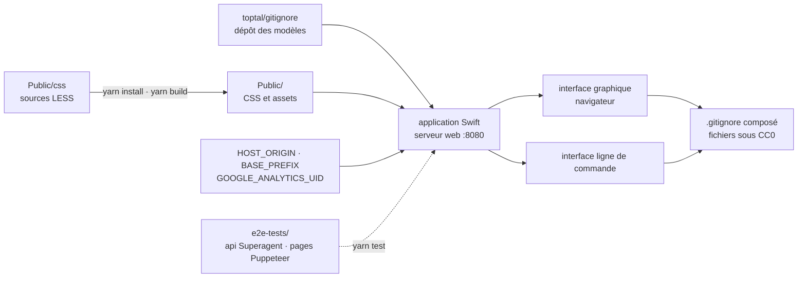

# toptal/gitignore.io

> **Le code du service web qui compose des fichiers `.gitignore`, pour qui veut l'héberger lui-même.**

## Le problème

Écrire un `.gitignore` à la main revient à se souvenir de ce que produisent son système, son
éditeur, son IDE et son langage — et on l'oublie toujours à moitié, jusqu'au jour où un
`.DS_Store`, un dossier `node_modules` ou un fichier de configuration local part dans un commit.
Le service public existe déjà sur le web ; ce qui manque, quand on travaille derrière un réseau
fermé ou qu'on veut une instance interne, c'est de pouvoir le faire tourner chez soi.

## Ce que ça fait vraiment

Ce dépôt est le code du site `.gitignore.io`, décrit dans le README comme *un service web conçu
pour aider à créer des fichiers `.gitignore` pour ses dépôts Git*. Le site offre deux voies pour
la même composition : une interface graphique et une méthode en ligne de commande, l'une comme
l'autre paramétrées par système d'exploitation, langage de programmation ou IDE.

Le point important est ce que le dépôt **ne contient pas** : les modèles eux-mêmes. Le README
renvoie vers un second dépôt, `toptal/gitignore`, comme source des gabarits. Ici on trouve
l'application elle-même — écrite en Swift d'après les badges, servie sur le port 8080, avec ses
feuilles de style en LESS sous `Public/css` compilées par `yarn build`, et ses tests de bout en
bout dans `e2e-tests` (API avec Superagent, pages avec Puppeteer).

Trois variables d'environnement, toutes facultatives, pilotent le déploiement : `HOST_ORIGIN`
(l'origine du serveur, qui retombe sur `https://www.toptal.com`), `BASE_PREFIX` (pour héberger
sous un sous-répertoire) et `GOOGLE_ANALYTICS_UID` (identifiant du snippet Google Tag Manager).

Les fichiers produits par le service public sont placés sous CC0, mention distincte de la licence
du code.

## Comment c'est branché



Aucun diagramme tiré du code n'existe pour ce dépôt : ce schéma est reconstruit depuis le seul
README, et n'utilise donc que les chemins qu'il nomme (`Public/css`, `Public`, `Resources`,
`e2e-tests/api`, `e2e-tests/pages`). En mode développement, `Public` et `Resources` sont montés
comme volumes Docker.

## Essayer

```
docker-compose up --build
```

En développement, le README donne deux étapes séparées :

```
docker-compose -f ./docker-compose-dev.yml build
```
```
docker-compose -f ./docker-compose-dev.yml up
```

Le serveur web écoute alors sur `http://localhost:8080`. Pour les feuilles de style et les tests
de bout en bout :

```
yarn install
yarn build

docker-compose up --build --detach
yarn gitupdate
yarn install
yarn build
yarn test
docker-compose stop
```

## Coût et pièges

- **Docker est le seul chemin documenté.** Le README ne décrit aucune compilation Swift directe :
  la seule procédure donnée passe par `docker-compose`. Pas de `docker`, pas de mode d'emploi.
- **Node et Yarn en version précise** pour les tests : le README exige Node.js 12.9 ou plus, et
  Yarn 1.15.2 ou 1.17.3 — deux versions nommées, pas une borne ouverte. Sur une machine récente,
  c'est la première chose à installer à côté.
- **Télémétrie optionnelle mais câblée** : `GOOGLE_ANALYTICS_UID` injecte un snippet Google Tag
  Manager. Laissée vide, elle ne devrait rien envoyer, mais le code du snippet est dans l'appli.
- **Dépendance à un dépôt tiers** : les modèles viennent de `toptal/gitignore`, et `yarn gitupdate`
  apparaît dans la procédure de test — une instance auto-hébergée n'est à jour que si cette source
  l'est aussi.
- **`HOST_ORIGIN` retombe sur `https://www.toptal.com`** : sans configuration explicite, l'instance
  se présente sous l'origine de l'éditeur. À fixer avant tout usage interne.
- **Signaux d'âge dans le README** : badge Swift 4.1, intégration continue Travis CI, Yarn 1.x.
  Rien n'indique une mise à niveau récente de la chaîne de construction.
- Côté facture, rien à payer : licence MIT d'après le catalogue, fichiers générés sous CC0.

## Ce que ce n'est pas

- **Ce n'est pas la collection de modèles `.gitignore`.** C'est le malentendu principal : qui
  cherche les gabarits par langage doit aller sur `toptal/gitignore`, que le README désigne
  explicitement comme la source. Ici il n'y a que le service qui les assemble.
- **Ce n'est pas un outil en ligne de commande à installer.** Le README parle d'une « méthode en
  ligne de commande » offerte *par le site* — pas d'un binaire local, et aucune installation de
  client n'est documentée.
- **Ce n'est pas nécessaire pour la plupart des gens** : le service public est en ligne et
  gratuit. Ce dépôt n'a d'intérêt que si l'on veut sa propre instance — réseau fermé, politique
  interne, modèles maison.
- **Ce n'est pas un linter ni un correcteur de dépôt** : il compose un fichier au départ, il ne
  détecte pas les fichiers déjà suivis par erreur ni ne nettoie un historique.

## Alternatives

| | Quand le préférer |
|---|---|
| **toptal/gitignore** | Nommé dans le README comme la source des modèles. À préférer dès qu'on veut les gabarits eux-mêmes plutôt qu'un service qui les assemble : un `git clone` suffit, pas de Docker, pas de serveur à tenir. |

Les voisins proposés par le catalogue (`SwiftyBeaver/SwiftyBeaver`, `vapor/vapor`,
`txthinking/brook`, `apple/swift-openapi-generator`) ne sont pas comparables : ils partagent avec
ce dépôt le seul langage Swift — journalisation, cadre web, tunnel réseau, générateur de code —
et aucun ne produit de fichiers `.gitignore`.

## Pour toi

Peu d'intérêt comme brique technique dans une chaîne data ou MLOps : on utilise le site public en
deux clics et on passe à autre chose. Le cas où ce dépôt compte est étroit et réel — poste ou
réseau coupé d'Internet, ou volonté d'ajouter des modèles internes (secrets, artefacts de
notebooks, sorties d'entraînement) à un catalogue maison. À surveiller à ce titre, pas à adopter
par défaut.
