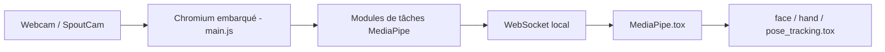

# torinmb/mediapipe-touchdesigner

> Plugin TouchDesigner qui apporte les modèles de vision MediaPipe accélérés par GPU, pour artistes numériques.

## Le problème
Récupérer dans TouchDesigner des données de suivi (visage, mains, pose) demande d'installer des bibliothèques locales.

## Ce que ça fait vraiment
Un composant `MediaPipe.tox` lance un Chromium embarqué qui exécute MediaPipe en JavaScript/WebAssembly avec accélération GPU. Les résultats reviennent en JSON par un serveur WebSocket local, puis des composants `.tox` (visage, mains, pose, objets, segmentation, classification) les convertissent. Les modèles sont embarqués dans le fichier. Entrée limitée à 720p ; Spout (Windows) ou Syphon via OBS (Mac) pour injecter une source.

## Comment c'est branché


## Essayer
```bash
npm install --global yarn
yarn install
yarn dev
yarn build
```
Usage courant : télécharger `release.zip` et ouvrir `MediaPipe TouchDesigner.toe`.

## Coût et pièges
Nécessite TouchDesigner (logiciel tiers). Cocher « Enable External .tox » sinon le fichier devient énorme. Les tâches sont gourmandes en CPU/GPU : désactiver celles non utilisées.

## Ce que ce n'est pas
Ce n'est pas une bibliothèque Python de vision : il ne fonctionne que dans TouchDesigner. Segmentation interactive et image embedding ne sont pas gérés.

## Alternatives
Aucune alternative nommée dans le README.

## Pour toi
À ignorer sauf si tu fais de l'art génératif sous TouchDesigner : hors du périmètre data/IA/MLOps.

