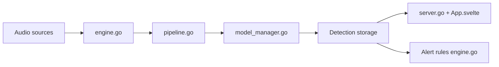

# tphakala/birdnet-go

> Analyseur auto-hébergé de sons d'oiseaux, faune et chauves-souris en temps réel, pour passionnés et chercheurs.

## Le problème
Identifier des espèces en continu sur un flux audio demande une chaîne de capture, de modèles et d'alertes.

## Ce que ça fait vraiment
Capte une carte son ou des flux RTSP, classe avec BirdNET v2.4, Perch v2, BattyBirdNET et un modèle de géolocalisation, avec consensus entre modèles. Interface Svelte avec spectrogramme en direct, alertes (Discord, MQTT avec Home Assistant, webhooks…), SQLite ou MySQL, OIDC, sauvegardes. Un seul binaire, Raspberry Pi 4 suffisant.

## Comment c'est branché


## Essayer
```bash
curl -fsSL https://github.com/tphakala/birdnet-go/raw/main/install.sh -o install.sh
bash ./install.sh
```

## Coût et pièges
Gratuit, local. Télémétrie Sentry strictement optionnelle. Taxonomie eBird sous conditions non commerciales. Licence présente mais non identifiée par GitHub : à vérifier. 188 issues ouvertes.

## Ce que ce n'est pas
Pas un outil d'entraînement général (classifieur TFLite perso possible). Les modèles chauves-souris exigent un micro ultrasons.

## Alternatives
BirdNET-Analyzer (amont) ; birda pour l'analyse hors ligne de fichiers, nommés dans le README.

## Pour toi
À adopter pour un cas d'usage bioacoustique ou comme exemple d'inférence edge temps réel ; vérifie la licence avant toute redistribution.

