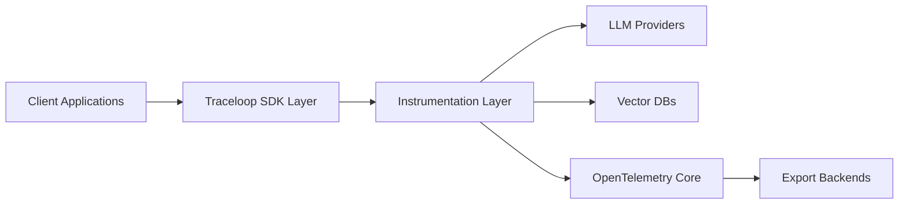

# traceloop/openllmetry

> Instrumentations OpenTelemetry pour tracer appels LLM, bases vectorielles et frameworks d'agents.

## Le problème
Les appels LLM échappent à l'observabilité existante : ni latence, ni tokens, ni prompts dans Datadog ou Honeycomb.

## Ce que ça fait vraiment
Des instrumentations OTel standard pour OpenAI, Anthropic, Bedrock, Gemini, Ollama, Mistral…
Des bases vectorielles (Chroma, Pinecone, Qdrant, Weaviate, Milvus…) et des frameworks (LangChain, LlamaIndex, CrewAI, LangGraph…), plus MCP.
Un SDK `traceloop-sdk` qui s'initialise en une ligne et produit des données OTel standard.
Les instrumentations s'utilisent seules si OTel est déjà en place.

## Comment c'est branché


## Essayer
```bash
pip install traceloop-sdk
```

## Coût et pièges
Gratuit ; il faut un backend d'observabilité (le tien ou un SaaS). Les versions antérieures à 0.49.2 collectaient de la télémétrie.

## Ce que ce n'est pas
Pas un backend ni un tableau de bord : il produit des traces, à envoyer ailleurs. 680 issues ouvertes.

## Alternatives
- OpenLLMetry-JS : la version JS/TS.

## Pour toi
À adopter pour instrumenter tes applications LLM : c'est du standard OpenTelemetry, donc pas d'enfermement, et ça se branche sur l'observabilité existante.
