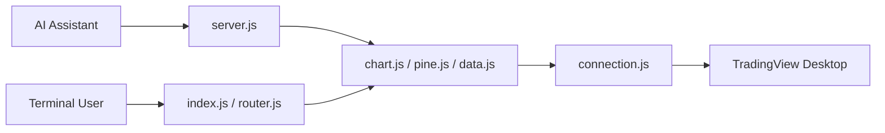

# tradesdontlie/tradingview-mcp

> Serveur MCP et CLI pilotant TradingView Desktop via Chrome DevTools Protocol, pour Claude Code.

## Le problème
Un agent IA ne peut ni lire ni manipuler les graphiques, indicateurs et scripts Pine d'une application TradingView locale.

## Ce que ça fait vraiment
Se connecte à TradingView Desktop lancé avec `--remote-debugging-port=9222` et exécute du JavaScript via CDP.
78+ outils MCP : lecture d'état et d'indicateurs, changement de symbole, dessins, alertes, replay, panneaux, captures.
Développement Pine Script (injection, compilation, erreurs) ; streaming JSONL par sondage.
Chaque outil existe aussi en commande CLI `tv` à sortie JSON.

## Comment c'est branché


## Essayer
```bash
git clone https://github.com/tradesdontlie/tradingview-mcp.git
cd tradingview-mcp
npm install
./scripts/launch_tv_debug_linux.sh
node src/cli/index.js <command>
npm test
```

## Coût et pièges
Abonnement TradingView payant ; utilise des API internes non documentées qui cassent à chaque mise à jour.
Usage possiblement contraire aux conditions de TradingView (le README l'écrit lui-même).

## Ce que ce n'est pas
Pas un bot de trading : aucune exécution réelle d'ordres.
Pas affilié à TradingView ni stable dans le temps.

## Alternatives
Aucune alternative nommée dans le README.

## Pour toi
À ignorer : fragile, juridiquement risqué et de niche ; seul le motif « app Electron rendue lisible à un agent via CDP » mérite d'être retenu.
