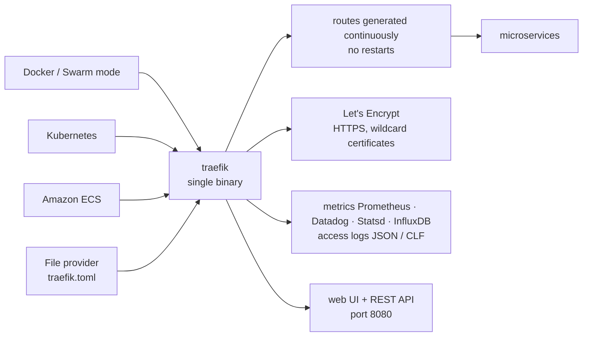

# traefik/traefik

> **A reverse proxy that reads your orchestrator's API and builds its own routes.**

## The problem

A traditional reverse proxy expects you to declare *each* route connecting a path or subdomain
to *each* service. In an environment where services are added, killed, upgraded and scaled many
times a day, keeping that table current turns into a chore, and every change goes through a
hand-edited config reload.

## What it actually does

Traefik listens to the service registry or orchestrator API (Docker, Swarm mode, Kubernetes,
ECS, Consul, Etcd, Rancher v2) and generates routes as services appear and disappear. The README
states it updates its configuration continuously, with no restarts, and presents pointing
Traefik at the orchestrator as the only configuration step required. Manual routes remain
possible, notably through the `File` provider.

Around that core, the README lists what the binary carries itself: several load balancing
algorithms, HTTPS backed by Let's Encrypt (wildcard certificates included), circuit breakers and
retries, WebSocket, HTTP/2 and gRPC, metrics (Rest, Prometheus, Datadog, Statsd, InfluxDB 2.X),
access logs (JSON, CLF), a REST API and a plain HTML web dashboard. All of it ships as a single
Go binary and as an official Docker image.

## How it is wired



No code-derived diagram exists for this repository: the graph above is reconstructed from the
README alone. The thing to read in it is that the providers on the left are *configuration
sources*, not traffic: traffic enters on port 80 and leaves towards the microservices, while the
routing table is fed continuously by the orchestrator API.

## Trying it

The README points first at a "5-Minute Quickstart" in the documentation, which assumes Docker.
The commands it gives directly:

```shell
./traefik --configFile=traefik.toml
```

```shell
docker run -d -p 8080:8080 -p 80:80 -v $PWD/traefik.toml:/etc/traefik/traefik.toml traefik
```

```shell
git clone https://github.com/traefik/traefik
```

The binary comes from the releases page, and the repository's `traefik.sample.toml` serves as a
starting configuration. No build-from-source command is given in the README.

## Cost and pitfalls

- **Free and MIT** for the code; support is the paid part. The README explicitly separates
  community support (Discourse forum) from **commercial support**, obtained by emailing
  Traefik.io. No quota or API key is needed to run the proxy itself.
- **External service dependency for HTTPS**: certificates go through Let's Encrypt, with its
  rate limits and its need for a resolvable domain. Without outbound access to the authority,
  that part does not work.
- **Major migrations break things**: the README opens with a warning pointing to the v2 to v3
  migration guide and flags breaking changes. The linked documentation is the v3 one.
- **Short support window**: three to four minor releases a year, and "each version is supported
  until the next one is released". Staying on an older minor means staying without fixes.
- **Exposed surface**: the Docker example publishes port 8080 (web UI and REST API) alongside
  port 80. Convenient while exploring, not something to leave open elsewhere.
- **The real cost is dynamic configuration**, not installation: behaviour depends on labels and
  resources declared on the orchestrator side, described in the online documentation rather than
  in the README.

## What it is not

- **It is not a web server.** Traefik routes and balances; it does not serve static files or run
  an application. Something has to sit behind it.
- **It is not zero configuration** despite the README's promise. Pointing it at the orchestrator
  is enough to start, but routing rules, certificates and middlewares are declared somewhere —
  and the README shows none of that, deferring everything to doc.traefik.io.
- **It is not a web application firewall**: circuit breakers and retries are resilience, not
  attack filtering. Nothing in the README mentions WAF or intrusion detection.
- **It is not the full commercial product**: this repository is the open source proxy; whatever
  belongs to Traefik Labs' paid offering is not here, and the README does not draw the line.

## Alternatives

| | When to pick it instead |
|---|---|
| **bunkerity/bunkerweb** | A catalogue neighbour, positioned as a security-oriented reverse proxy. Pick it when HTTP filtering and hardening matter more than automatic service discovery. |
| **yusing/godoxy** | A catalogue neighbour, also a reverse proxy with Docker discovery. Worth a look for a lighter standalone Docker setup; Traefik stays the choice once Kubernetes or ECS is involved. |

The remaining neighbours are not comparable: `techschool/simplebank` is a backend learning
project and `gravitational/teleport` is identity-based infrastructure access — neither does
orchestrator-driven HTTP routing.

## For you

This is the piece that puts a model API, an MLflow dashboard or an inference service behind a
domain name and TLS without hand-writing nginx config on every deploy — with Prometheus metrics
already wired in, which saves one more exporter. Worth adopting as soon as you run several
services under Docker Compose or Kubernetes. Skip it if you expose a single service on a single
machine: a static proxy costs fewer concepts.
