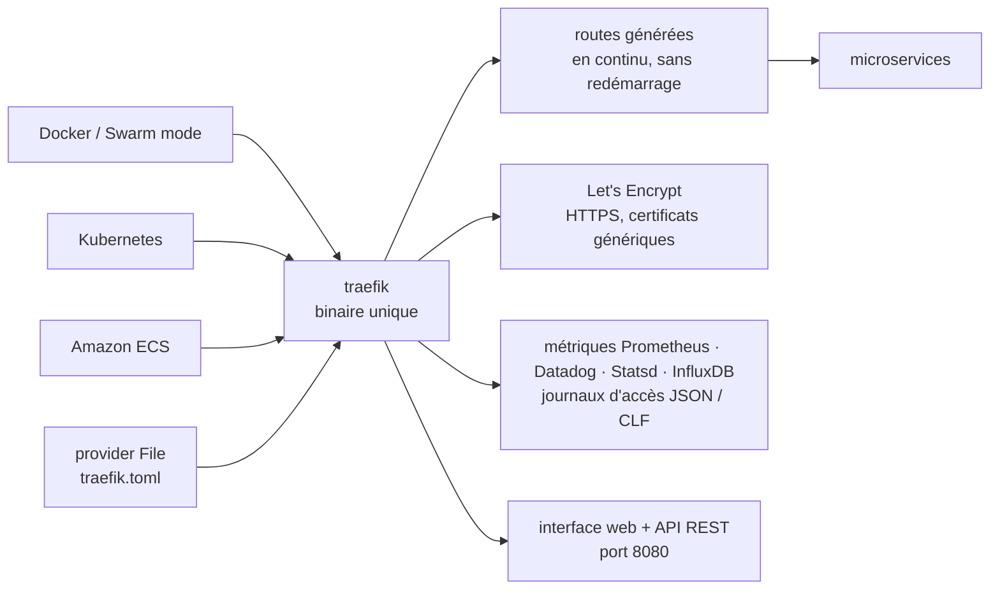

# traefik/traefik

> **Un proxy inverse qui lit l'API de ton orchestrateur et fabrique ses routes tout seul.**

## Le problème

Un proxy inverse classique demande qu'on déclare *chaque* route reliant un chemin ou un
sous-domaine à *chaque* service. Dans un environnement où l'on ajoute, tue, met à jour et met
à l'échelle des services plusieurs fois par jour, tenir cette table à jour devient une corvée,
et chaque modification passe par un rechargement de configuration à la main.

## Ce que ça fait vraiment

Traefik écoute l'API du registre de services ou de l'orchestrateur (Docker, Swarm mode,
Kubernetes, ECS, Consul, Etcd, Rancher v2) et génère les routes au fur et à mesure que les
services apparaissent et disparaissent. Le README annonce qu'il met à jour sa configuration
« en continu, sans redémarrage » ; pointer Traefik vers l'orchestrateur est présenté comme la
seule étape de configuration nécessaire. La configuration manuelle de routes reste possible,
notamment via le provider `File`.

Autour de ce cœur, le README liste ce que le binaire embarque lui-même : plusieurs algorithmes
d'équilibrage de charge, HTTPS adossé à Let's Encrypt (certificats génériques compris),
disjoncteurs et réessais, WebSocket, HTTP/2 et gRPC, des métriques (Rest, Prometheus, Datadog,
Statsd, InfluxDB 2.X), des journaux d'accès (JSON, CLF), une API REST et une interface web HTML
de consultation. Le tout est livré comme un binaire unique écrit en Go, et comme image Docker
officielle.

## Comment c'est branché



Aucun diagramme tiré du code n'existe pour ce dépôt : ce schéma est reconstruit depuis le seul
README. Le point de lecture est que les providers à gauche sont des *sources de configuration*,
pas du trafic : le trafic entre par le port 80 et ressort vers les microservices, tandis que la
table de routage est alimentée en continu par l'API de l'orchestrateur.

## Essayer

Le README renvoie d'abord vers un « 5-Minute Quickstart » de la documentation, qui suppose
Docker. Les commandes qu'il donne directement :

```shell
./traefik --configFile=traefik.toml
```

```shell
docker run -d -p 8080:8080 -p 80:80 -v $PWD/traefik.toml:/etc/traefik/traefik.toml traefik
```

```shell
git clone https://github.com/traefik/traefik
```

Le binaire se récupère sur la page des releases, le fichier `traefik.sample.toml` du dépôt sert
de configuration de départ. Aucune commande de compilation depuis les sources n'est donnée dans
le README.

## Coût et pièges

- **Gratuit et MIT** pour le code ; le support est le point payant. Le README distingue
  explicitement le support communautaire (forum Discourse) du **support commercial**, à demander
  par courriel à Traefik.io. Pas de quota ni de clé d'API pour utiliser le proxy lui-même.
- **Dépendance à un service externe pour HTTPS** : les certificats passent par Let's Encrypt,
  avec ses limites de débit et son exigence d'un domaine résolvable. Sans accès sortant vers
  l'autorité, cette partie ne fonctionne pas.
- **Les migrations majeures cassent** : le README ouvre sur un avertissement renvoyant au guide
  de migration v2 → v3, et prévient de changements incompatibles. La documentation liée est
  celle de la v3.
- **Fenêtre de support courte** : trois à quatre versions mineures par an, et « chaque version
  est supportée jusqu'à la sortie de la suivante ». Rester sur une mineure ancienne veut dire
  rester sans correctifs.
- **Surface exposée** : l'exemple Docker publie le port 8080 (interface web et API REST) en même
  temps que le port 80. C'est commode en découverte, pas ce qu'on laisse ouvert ailleurs.
- **Le coût réel est la configuration dynamique**, pas l'installation : le comportement dépend
  d'étiquettes et de ressources déclarées côté orchestrateur, décrites dans la documentation en
  ligne et non dans le README.

## Ce que ce n'est pas

- **Ce n'est pas un serveur web.** Traefik route et équilibre ; il ne sert pas de fichiers
  statiques ni n'exécute d'application. Il faut quelque chose derrière lui.
- **Ce n'est pas une configuration nulle** malgré la promesse du README. « Pointer Traefik vers
  l'orchestrateur » suffit à démarrer, mais les règles de routage, les certificats et les
  middlewares se déclarent — le README ne montre aucun de ces déclaratifs, tout est renvoyé à
  doc.traefik.io.
- **Ce n'est pas un pare-feu applicatif** : disjoncteurs et réessais sont de la résilience, pas
  du filtrage d'attaques. Rien dans le README ne parle de WAF ni de détection d'intrusion.
- **Ce n'est pas le produit commercial complet** : ce dépôt est le proxy open source ; ce qui
  relève de l'offre payante de Traefik Labs n'y figure pas, et le README n'en dresse pas la
  frontière.

## Alternatives

| | Quand le préférer |
|---|---|
| **bunkerity/bunkerweb** | Voisin du catalogue, positionné comme proxy inverse orienté sécurité. À préférer si l'objectif est le filtrage et le durcissement HTTP plutôt que la découverte automatique de services. |
| **yusing/godoxy** | Voisin du catalogue, également proxy inverse avec découverte Docker. À regarder pour un déploiement Docker isolé plus léger ; Traefik reste le choix dès que Kubernetes ou ECS entrent en jeu. |

Les autres voisins ne sont pas comparables : `techschool/simplebank` est un projet
d'apprentissage backend et `gravitational/teleport` un accès infrastructure à base d'identité —
ni l'un ni l'autre ne fait du routage HTTP piloté par l'orchestrateur.

## Pour toi

C'est la brique qui met une API de modèle, un tableau de bord MLflow ou un service d'inférence
derrière un nom de domaine et du TLS sans écrire de configuration nginx à chaque déploiement —
avec les métriques Prometheus déjà câblées, ce qui évite un exporteur de plus. À adopter dès
qu'on fait tourner plusieurs services sous Docker Compose ou Kubernetes. À ignorer si l'on
n'expose qu'un seul service sur une seule machine : un proxy statique coûte moins de concepts.
