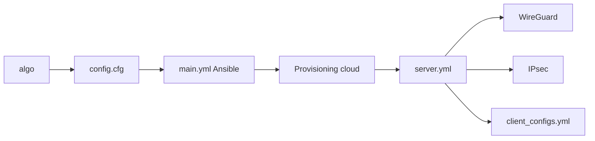

# trailofbits/algo

> Scripts Ansible qui montent un VPN personnel WireGuard et IPsec sur un serveur cloud, pour utilisateurs soucieux de sécurité.

## Le problème
Les VPN commerciaux imposent de faire confiance à un fournisseur, et les montages manuels laissent des réglages faibles.

## Ce que ça fait vraiment
Déploie sur un fournisseur cloud (DigitalOcean, EC2, Lightsail, Azure, GCE, Hetzner, Vultr…) ou sur ton Ubuntu un serveur WireGuard et IPsec IKEv2 avec crypto moderne. Génère fichiers de configuration, QR codes et profils Apple, gère les utilisateurs, offre un DNS local avec blocage de pubs, du tunnel SSH et des réglages de confidentialité (journaux effacés après 7 jours).

## Comment c'est branché


## Essayer
```bash
git clone https://github.com/trailofbits/algo.git
./algo
./algo update-users
```

## Coût et pièges
Compte chez un fournisseur cloud : la facture du serveur est à ta charge. Pour ajouter des utilisateurs IPsec plus tard, il faut conserver le PKI au déploiement. Licence AGPL-3.0.

## Ce que ce n'est pas
Pas un outil d'anonymat ni de contournement de censure : le README le dit. Le fournisseur cloud voit les métadonnées réseau.

## Alternatives
Aucune alternative nommée dans le README.

## Pour toi
Adopter si tu veux un accès sûr à tes machines ou GPU distants ; compte le coût du serveur et l'AGPL si tu modifies et redistribues.

