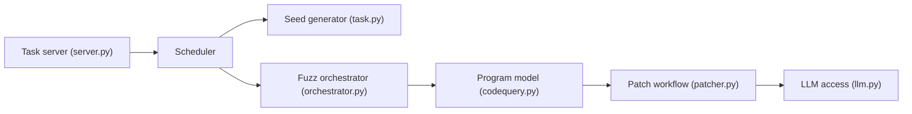

# trailofbits/buttercup

> Système de raisonnement cyber de Trail of Bits qui fuzze du code open source et génère des correctifs par agents LLM.

## Le problème
Trouver puis corriger des vulnérabilités dans de grands dépôts demande beaucoup de travail humain.

## Ce que ça fait vraiment
- Orchestrateur, générateur de graines, fuzzers (sur oss-fuzz), modèle de programme et patcher multi-agents.
- Conçu pour le défi DARPA AIxCC ; démarre sur l'exemple libpng.
- Observabilité SigNoz locale, interface web de suivi des tâches, LangFuse optionnel pour les coûts LLM.
- Un budget LLM est configurable.

## Comment c'est branché


## Essayer
```bash
git clone --recurse-submodules https://github.com/trailofbits/buttercup.git
cd buttercup
make setup-local
make deploy
make status
make send-libpng-task
make web-ui
make undeploy
```

## Coût et pièges
8 cœurs, 16 Go de RAM, 100 Go de disque. Les appels aux LLM (OpenAI, Anthropic, Google) sont facturés et continuent tant qu'on n'a pas fait `make undeploy`.

## Ce que ce n'est pas
Pas un outil léger ni garanti : projet de compétition, déploiement Kubernetes local.

## Alternatives
Aucune alternative nommée dans le README.

## Pour toi
À surveiller : référence intéressante d'agents LLM appliqués à la sécurité du code, mais lourd et coûteux à faire tourner.

