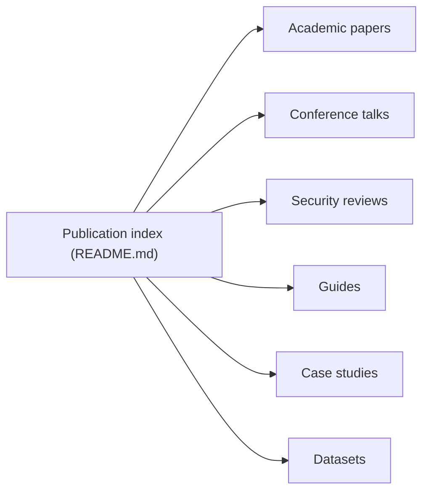

# trailofbits/publications

> Catalogue des articles, présentations, rapports d'audit et guides publiés par Trail of Bits.

## Le problème
Retrouver au même endroit la production publique d'un cabinet de sécurité : papiers, conférences, audits, divulgations.

## Ce que ça fait vraiment
- Tables classées : articles académiques, livres blancs, guides, présentations par thème, podcasts, webinaires, commentaires publics.
- Études de cas et audits par client et par technologie (blockchain, cryptographie, cloud, IA/ML).
- Divulgations de vulnérabilités avec identifiants CVE.
- Une section Machine Learning (injection de prompt, fichiers pickle, mise à l'échelle d'image).

## Comment c'est branché

## Essayer
Aucune commande documentée : lire le README.

## Coût et pièges
Gratuit. Beaucoup de liens externes ; le README est une très longue table.

## Ce que ce n'est pas
Pas un outil ni du code. Pas une base de connaissances à jour de tout ce que publie l'entreprise.

## Alternatives
Aucune alternative nommée dans le README.

## Pour toi
À surveiller : bonne source de lecture sur la sécurité de l'IA et du ML (pickle, MCP, prompt injection), à consulter ponctuellement.

