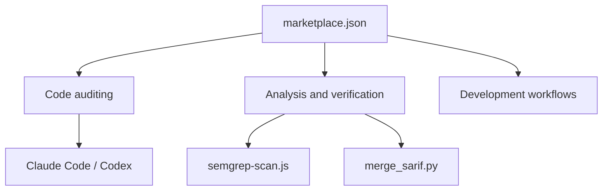

# trailofbits/skills

> Marketplace de plugins Claude Code par Trail of Bits, pour l'audit de sécurité et la revue de code.

## Le problème
Cadrer un assistant IA pour des tâches de sécurité (audit, analyse statique, vérification) demande des instructions expertes, longues à écrire soi-même.

## Ce que ça fait vraiment
Un catalogue de plugins installables : audit de code (C/C++, Rust, workflows GitHub Actions, dépendances), analyse statique (CodeQL, Semgrep, sortie SARIF), vérification (tests de mutation, tests par propriétés, analyse en temps constant), règles YARA, DWARF, contrats intelligents, plus des outils de développement (devcontainer, git-cleanup, modern-python). Utilisable aussi depuis Codex et un espace ChatGPT. Le dépôt contient aussi des scripts (audit.js, collect.py, merge_sarif.py…). Les implémentations non échantillonnées ne sont pas détaillées.

## Comment c'est branché


## Essayer
```bash
/plugin marketplace add trailofbits/skills
/plugin menu
codex plugin marketplace add trailofbits/skills
codex plugin list
codex plugin add <plugin-name>@trailofbits
```

## Coût et pièges
Les plugins sont gratuits, mais l'exécution consomme l'abonnement ou l'API de l'agent hôte (Claude Code, Codex). Licence CC-BY-SA-4.0, peu courante pour du code : à vérifier avant de réutiliser. Les plugins agissent sur un code qu'on a le droit d'auditer.

## Ce que ce n'est pas
Pas un scanner autonome : ce sont des consignes et scripts pilotés par un agent, dont les résultats demandent une vérification humaine. Presque tout vise la sécurité, pas le travail data.

## Alternatives
Le README cite des dépôts voisins du même éditeur : claude-code-config, codex-config, skills-curated, claude-code-devcontainer.

## Pour toi
À surveiller : modern-python, static-analysis et devcontainer-setup peuvent servir en MLOps, mais l'essentiel est orienté audit sécurité, et la licence est à confirmer.

