# trekhleb/javascript-algorithms

> **A catalogue of algorithms and data structures in JavaScript, written to be read and revised.**

## The problem

Revising data structures, or preparing for a technical interview, means juggling a theory
textbook, code snippets found at random, and no tests to confirm you understood anything.
Implementations found online are rarely commented, rarely tested, and never placed side by side
so two paradigms can be compared on the same problem.

## What it actually does

The repository gathers standalone JavaScript implementations, one per directory, each with its
own explanatory README and further-reading links (including YouTube videos). Every entry is
tagged `B` (beginner) or `A` (advanced).

The data-structure catalogue runs from linked list, stack, queue and hash table through to trie,
AVL, red-black, segment and Fenwick trees, directed and undirected graphs, disjoint set, Bloom
filter and LRU cache.

Algorithms are indexed twice: *by topic* (math, strings, sorting, search, graphs, image
processing with seam carving, machine-learning examples) and *by paradigm* (brute force, greedy,
divide and conquer, dynamic programming, backtracking, branch and bound). The same problem —
`Jump Game`, `Maximum Subarray` — therefore appears under several paradigms, which is the
teaching point.

Everything is covered by Jest tests and a GitHub Actions CI, and a `src/playground/` directory
is provided for experimenting with your own code.

The README also carries reference tables: Big O orders of growth, operation complexity per data
structure, and comparative sorting complexity (best / average / worst, memory, stability).

## How it is wired

```mermaid
flowchart TD

subgraph group_structures["Data structures"]
  node_comparator["Comparator<br/>shared utility<br/>[Comparator.js]"]
  node_graph["Graph model<br/>graph structure<br/>[Graph.js]"]
  node_graph_vertex["Graph vertex<br/>graph model<br/>[GraphVertex.js]"]
  node_graph_edge["Graph edge<br/>graph model<br/>[GraphEdge.js]"]
  node_heap["Heap<br/>ordered primitive<br/>[Heap.js]"]
  node_priority_queue["Priority queue<br/>frontier primitive<br/>[PriorityQueue.js]"]
  node_disjoint_set["Disjoint set<br/>connectivity primitive<br/>[DisjointSet.js]"]
  node_linked_tree["Linked and tree structures<br/>mutable structures<br/>[LinkedList.js]"]
end

subgraph group_algorithms["Algorithms"]
  node_graph_algorithms["Graph algorithms<br/>algorithm family<br/>[dijkstra.js]"]
  node_sorting_base["Sort base<br/>algorithm base<br/>[Sort.js]"]
  node_sorting_algorithms["Sorting algorithms<br/>algorithm family<br/>[QuickSort.js]"]
  node_numeric_algorithms["Math, set and DP<br/>algorithm family<br/>[Matrix.js]"]
  node_string_algorithms["String and hashing<br/>algorithm family"]
  node_image_ml["Image and ML examples<br/>specialized algorithms"]
end

subgraph group_quality["Quality tooling"]
  node_jest["Jest tests<br/>test runner<br/>[jest.config.js]"]
  node_playground_test["Playground test<br/>test boundary<br/>[playground.test.js]"]
  node_ci["GitHub Actions CI<br/>continuous integration<br/>[CI.yml]"]
  node_node_npm["Node and npm<br/>runtime<br/>[package.json]"]
end

node_readme["Repository index<br/>documentation<br/>[README.md]"]
node_playground["Playground<br/>experiment entry<br/>[playground.js]"]

node_readme -.->|"points to"| node_playground
node_playground -->|"imports modules"| node_graph
node_graph -->|"uses"| node_graph_vertex
node_graph -->|"uses"| node_graph_edge
node_graph_algorithms -->|"consumes"| node_graph
node_graph_algorithms -->|"uses frontier"| node_priority_queue
node_graph_algorithms -->|"uses connectivity"| node_disjoint_set
node_priority_queue -->|"builds on"| node_heap
node_heap -->|"compares with"| node_comparator
node_sorting_base -->|"uses"| node_comparator
node_sorting_algorithms -->|"extends"| node_sorting_base
node_playground_test -->|"exercises"| node_playground
node_jest -->|"runs"| node_playground_test
node_ci -->|"sets up"| node_node_npm
node_ci -->|"runs verification"| node_jest
node_node_npm -.->|"executes"| node_playground

click node_readme "https://github.com/trekhleb/javascript-algorithms/blob/master/README.md"
click node_playground "https://github.com/trekhleb/javascript-algorithms/blob/master/src/playground/playground.js"
click node_comparator "https://github.com/trekhleb/javascript-algorithms/blob/master/src/utils/comparator/Comparator.js"
click node_graph "https://github.com/trekhleb/javascript-algorithms/blob/master/src/data-structures/graph/Graph.js"
click node_graph_vertex "https://github.com/trekhleb/javascript-algorithms/blob/master/src/data-structures/graph/GraphVertex.js"
click node_graph_edge "https://github.com/trekhleb/javascript-algorithms/blob/master/src/data-structures/graph/GraphEdge.js"
click node_heap "https://github.com/trekhleb/javascript-algorithms/blob/master/src/data-structures/heap/Heap.js"
click node_priority_queue "https://github.com/trekhleb/javascript-algorithms/blob/master/src/data-structures/priority-queue/PriorityQueue.js"
click node_disjoint_set "https://github.com/trekhleb/javascript-algorithms/blob/master/src/data-structures/disjoint-set/DisjointSet.js"
click node_linked_tree "https://github.com/trekhleb/javascript-algorithms/blob/master/src/data-structures/linked-list/LinkedList.js"
click node_graph_algorithms "https://github.com/trekhleb/javascript-algorithms/blob/master/src/algorithms/graph/dijkstra/dijkstra.js"
click node_sorting_base "https://github.com/trekhleb/javascript-algorithms/blob/master/src/algorithms/sorting/Sort.js"
click node_sorting_algorithms "https://github.com/trekhleb/javascript-algorithms/blob/master/src/algorithms/sorting/quick-sort/QuickSort.js"
click node_numeric_algorithms "https://github.com/trekhleb/javascript-algorithms/blob/master/src/algorithms/math/matrix/Matrix.js"
click node_string_algorithms "https://github.com/trekhleb/javascript-algorithms/blob/master/src/algorithms/string/knuth-morris-pratt/knuthMorrisPratt.js"
click node_image_ml "https://github.com/trekhleb/javascript-algorithms/blob/master/src/algorithms/image-processing/seam-carving/resizeImageWidth.js"
click node_jest "https://github.com/trekhleb/javascript-algorithms/blob/master/jest.config.js"
click node_playground_test "https://github.com/trekhleb/javascript-algorithms/blob/master/src/playground/__test__/playground.test.js"
click node_ci "https://github.com/trekhleb/javascript-algorithms/blob/master/.github/workflows/CI.yml"
click node_node_npm "https://github.com/trekhleb/javascript-algorithms/blob/master/package.json"

classDef toneNeutral fill:#f8fafc,stroke:#334155,stroke-width:1.5px,color:#0f172a
classDef toneBlue fill:#dbeafe,stroke:#2563eb,stroke-width:1.5px,color:#172554
classDef toneAmber fill:#fef3c7,stroke:#d97706,stroke-width:1.5px,color:#78350f
classDef toneMint fill:#dcfce7,stroke:#16a34a,stroke-width:1.5px,color:#14532d
classDef toneRose fill:#ffe4e6,stroke:#e11d48,stroke-width:1.5px,color:#881337
classDef toneIndigo fill:#e0e7ff,stroke:#4f46e5,stroke-width:1.5px,color:#312e81
classDef toneTeal fill:#ccfbf1,stroke:#0f766e,stroke-width:1.5px,color:#134e4a
class node_comparator,node_graph,node_graph_vertex,node_graph_edge,node_heap,node_priority_queue,node_disjoint_set,node_linked_tree toneBlue
class node_graph_algorithms,node_sorting_base,node_sorting_algorithms,node_numeric_algorithms,node_string_algorithms,node_image_ml toneAmber
class node_jest,node_playground_test,node_ci,node_node_npm toneMint
class node_readme,node_playground toneNeutral
```



This diagram is derived from the repository's own code, with real file paths. The point is that
there is **no central entry point**: `Comparator.js` is shared, `Sort.js` is the base for the
sorting family, graph algorithms consume `Graph.js`, `PriorityQueue.js` and `DisjointSet.js`,
but every module is imported on its own. The quality chain (Jest, CI, `package.json`) wraps the
whole thing without orchestrating it.

## Trying it

```bash
npm install

npm run lint

npm test

npm test -- 'LinkedList'

npm test -- 'playground'
```

If linting or testing fails, the README gives:

```bash
rm -rf ./node_modules
npm i
```

The README also asks for the correct Node version (`>=16`), and notes that `nvm use` from the
project root picks it up.

## Cost and gotchas

- **Free, MIT licence, no API key, no third-party service, no GPU.** The only cost is reading
  time.
- **Node >=16 is required** to run the tests; the README lists a failing lint or test run as the
  usual symptom otherwise.
- **Nothing is published to npm**: the README documents no package install. You clone it, read
  it, and copy the file you need.
- **The hidden cost is translation.** The implementations are educational, not tuned for
  production: reusing them in a service means reviewing them yourself.
- The README exists in eighteen languages, but nothing indicates the translations track the
  English content.

## What it is not

- **Not a runtime library.** No documented npm package, no stable API, no performance guarantee:
  the repository presents itself as a set of *examples*. Using a hand-written sort instead of
  `Array.prototype.sort` is a teaching choice, not an engineering one.
- **Not a structured course.** It is an index: no imposed progression, no graded exercises, no
  assessment. The per-algorithm READMEs explain; they do not set a path.
- **Not a data-science toolkit.** The few machine-learning entries (k-means, k-NN) demonstrate
  the principle rather than being implementations meant to do work.

## Alternatives

| | When to prefer it |
|---|---|
| **TheAlgorithms/JavaScript** | Same language, same ground. Prefer it for the breadth of a community collection; prefer this one for the written explanation per directory and the paradigm indexing. |
| **TheAlgorithms/Python** | Prefer it if your working language is Python — as it is for most data profiles — and JavaScript adds nothing. |
| **EndlessCheng/codeforces-go** | Prefer it for competitive programming proper rather than for revising fundamentals. |

## For you

Watch it, do not adopt it as a dependency: for a data / AI / MLOps profile working in Python,
the value here is the prose, not the code — the paradigm indexing and the complexity tables make
a good refresher before an interview. If JavaScript is not in your stack, take the Python
equivalent and move on.
