# trekhleb/javascript-algorithms

> **Un catalogue d'algorithmes et de structures de données en JavaScript, écrit pour être lu et révisé.**

## Le problème

Réviser les structures de données ou préparer un entretien technique oblige à jongler entre un
manuel théorique, des extraits de code trouvés au hasard et aucun test pour vérifier qu'on a
compris. Les implémentations glanées en ligne sont rarement commentées, rarement testées, et
jamais rangées côte à côte pour comparer deux paradigmes sur le même problème.

## Ce que ça fait vraiment

Le dépôt rassemble des implémentations JavaScript autonomes, une par répertoire, chacune avec
son propre README d'explication et ses liens de lecture complémentaire (y compris des vidéos
YouTube). Chaque entrée est étiquetée `B` (débutant) ou `A` (avancé).

Le catalogue des structures va de la liste chaînée, la pile, la file et la table de hachage
jusqu'au trie, aux arbres AVL, rouge-noir, segment et Fenwick, au graphe orienté ou non, à
l'ensemble disjoint, au filtre de Bloom et au cache LRU.

Les algorithmes sont indexés deux fois : *par sujet* (maths, chaînes, tris, recherche, graphes,
traitement d'image avec le seam carving, exemples d'apprentissage automatique) et *par
paradigme* (force brute, glouton, diviser pour régner, programmation dynamique, retour sur
trace, séparation et évaluation) — le même problème, par exemple `Jump Game` ou `Maximum
Subarray`, apparaît donc sous plusieurs paradigmes, ce qui est l'intérêt pédagogique.

Tout est couvert par des tests Jest et une intégration continue GitHub Actions, et un
répertoire `src/playground/` est prévu pour expérimenter avec son propre code.

Le README embarque aussi des tables de référence : ordres de grandeur du Big O, complexité des
opérations par structure de données, et complexité comparée des tris (meilleur / moyen / pire,
mémoire, stabilité).

## Comment c'est branché

```mermaid
flowchart TD

subgraph group_structures["Data structures"]
  node_comparator["Comparator<br/>shared utility<br/>[Comparator.js]"]
  node_graph["Graph model<br/>graph structure<br/>[Graph.js]"]
  node_graph_vertex["Graph vertex<br/>graph model<br/>[GraphVertex.js]"]
  node_graph_edge["Graph edge<br/>graph model<br/>[GraphEdge.js]"]
  node_heap["Heap<br/>ordered primitive<br/>[Heap.js]"]
  node_priority_queue["Priority queue<br/>frontier primitive<br/>[PriorityQueue.js]"]
  node_disjoint_set["Disjoint set<br/>connectivity primitive<br/>[DisjointSet.js]"]
  node_linked_tree["Linked and tree structures<br/>mutable structures<br/>[LinkedList.js]"]
end

subgraph group_algorithms["Algorithms"]
  node_graph_algorithms["Graph algorithms<br/>algorithm family<br/>[dijkstra.js]"]
  node_sorting_base["Sort base<br/>algorithm base<br/>[Sort.js]"]
  node_sorting_algorithms["Sorting algorithms<br/>algorithm family<br/>[QuickSort.js]"]
  node_numeric_algorithms["Math, set and DP<br/>algorithm family<br/>[Matrix.js]"]
  node_string_algorithms["String and hashing<br/>algorithm family"]
  node_image_ml["Image and ML examples<br/>specialized algorithms"]
end

subgraph group_quality["Quality tooling"]
  node_jest["Jest tests<br/>test runner<br/>[jest.config.js]"]
  node_playground_test["Playground test<br/>test boundary<br/>[playground.test.js]"]
  node_ci["GitHub Actions CI<br/>continuous integration<br/>[CI.yml]"]
  node_node_npm["Node and npm<br/>runtime<br/>[package.json]"]
end

node_readme["Repository index<br/>documentation<br/>[README.md]"]
node_playground["Playground<br/>experiment entry<br/>[playground.js]"]

node_readme -.->|"points to"| node_playground
node_playground -->|"imports modules"| node_graph
node_graph -->|"uses"| node_graph_vertex
node_graph -->|"uses"| node_graph_edge
node_graph_algorithms -->|"consumes"| node_graph
node_graph_algorithms -->|"uses frontier"| node_priority_queue
node_graph_algorithms -->|"uses connectivity"| node_disjoint_set
node_priority_queue -->|"builds on"| node_heap
node_heap -->|"compares with"| node_comparator
node_sorting_base -->|"uses"| node_comparator
node_sorting_algorithms -->|"extends"| node_sorting_base
node_playground_test -->|"exercises"| node_playground
node_jest -->|"runs"| node_playground_test
node_ci -->|"sets up"| node_node_npm
node_ci -->|"runs verification"| node_jest
node_node_npm -.->|"executes"| node_playground

click node_readme "https://github.com/trekhleb/javascript-algorithms/blob/master/README.md"
click node_playground "https://github.com/trekhleb/javascript-algorithms/blob/master/src/playground/playground.js"
click node_comparator "https://github.com/trekhleb/javascript-algorithms/blob/master/src/utils/comparator/Comparator.js"
click node_graph "https://github.com/trekhleb/javascript-algorithms/blob/master/src/data-structures/graph/Graph.js"
click node_graph_vertex "https://github.com/trekhleb/javascript-algorithms/blob/master/src/data-structures/graph/GraphVertex.js"
click node_graph_edge "https://github.com/trekhleb/javascript-algorithms/blob/master/src/data-structures/graph/GraphEdge.js"
click node_heap "https://github.com/trekhleb/javascript-algorithms/blob/master/src/data-structures/heap/Heap.js"
click node_priority_queue "https://github.com/trekhleb/javascript-algorithms/blob/master/src/data-structures/priority-queue/PriorityQueue.js"
click node_disjoint_set "https://github.com/trekhleb/javascript-algorithms/blob/master/src/data-structures/disjoint-set/DisjointSet.js"
click node_linked_tree "https://github.com/trekhleb/javascript-algorithms/blob/master/src/data-structures/linked-list/LinkedList.js"
click node_graph_algorithms "https://github.com/trekhleb/javascript-algorithms/blob/master/src/algorithms/graph/dijkstra/dijkstra.js"
click node_sorting_base "https://github.com/trekhleb/javascript-algorithms/blob/master/src/algorithms/sorting/Sort.js"
click node_sorting_algorithms "https://github.com/trekhleb/javascript-algorithms/blob/master/src/algorithms/sorting/quick-sort/QuickSort.js"
click node_numeric_algorithms "https://github.com/trekhleb/javascript-algorithms/blob/master/src/algorithms/math/matrix/Matrix.js"
click node_string_algorithms "https://github.com/trekhleb/javascript-algorithms/blob/master/src/algorithms/string/knuth-morris-pratt/knuthMorrisPratt.js"
click node_image_ml "https://github.com/trekhleb/javascript-algorithms/blob/master/src/algorithms/image-processing/seam-carving/resizeImageWidth.js"
click node_jest "https://github.com/trekhleb/javascript-algorithms/blob/master/jest.config.js"
click node_playground_test "https://github.com/trekhleb/javascript-algorithms/blob/master/src/playground/__test__/playground.test.js"
click node_ci "https://github.com/trekhleb/javascript-algorithms/blob/master/.github/workflows/CI.yml"
click node_node_npm "https://github.com/trekhleb/javascript-algorithms/blob/master/package.json"

classDef toneNeutral fill:#f8fafc,stroke:#334155,stroke-width:1.5px,color:#0f172a
classDef toneBlue fill:#dbeafe,stroke:#2563eb,stroke-width:1.5px,color:#172554
classDef toneAmber fill:#fef3c7,stroke:#d97706,stroke-width:1.5px,color:#78350f
classDef toneMint fill:#dcfce7,stroke:#16a34a,stroke-width:1.5px,color:#14532d
classDef toneRose fill:#ffe4e6,stroke:#e11d48,stroke-width:1.5px,color:#881337
classDef toneIndigo fill:#e0e7ff,stroke:#4f46e5,stroke-width:1.5px,color:#312e81
classDef toneTeal fill:#ccfbf1,stroke:#0f766e,stroke-width:1.5px,color:#134e4a
class node_comparator,node_graph,node_graph_vertex,node_graph_edge,node_heap,node_priority_queue,node_disjoint_set,node_linked_tree toneBlue
class node_graph_algorithms,node_sorting_base,node_sorting_algorithms,node_numeric_algorithms,node_string_algorithms,node_image_ml toneAmber
class node_jest,node_playground_test,node_ci,node_node_npm toneMint
class node_readme,node_playground toneNeutral
```



Ce diagramme est tiré du code du dépôt, avec les vrais chemins de fichiers. Le point à retenir
est qu'il n'y a **pas de point d'entrée central** : `Comparator.js` est mutualisé, `Sort.js`
sert de base aux tris, les algorithmes de graphe consomment `Graph.js`, `PriorityQueue.js` et
`DisjointSet.js`, mais chaque module s'importe séparément. La chaîne de qualité (Jest, CI,
`package.json`) enveloppe le tout sans l'orchestrer.

## Essayer

```bash
npm install

npm run lint

npm test

npm test -- 'LinkedList'

npm test -- 'playground'
```

En cas d'échec du lint ou des tests, le README donne :

```bash
rm -rf ./node_modules
npm i
```

Le README précise aussi d'utiliser la bonne version de Node (`>=16`), et que `nvm use` depuis
la racine du projet la sélectionne.

## Coût et pièges

- **Gratuit, licence MIT, aucune clé d'API, aucun service tiers, aucun GPU.** Le seul coût est
  le temps de lecture.
- **Node >=16 requis** pour faire tourner les tests ; sans cela, le README documente un échec
  du lint ou des tests comme symptôme courant.
- **Rien n'est publié sur npm** : le README ne documente aucune installation en tant que
  paquet. On clone, on lit, on copie le fichier qui sert.
- **Le coût caché est la traduction.** Les implémentations sont pédagogiques, pas optimisées
  pour la production : les reprendre telles quelles dans un service suppose de les relire
  soi-même.
- Le README existe en dix-huit langues, mais rien n'indique que les traductions suivent le
  contenu anglais à jour.

## Ce que ce n'est pas

- **Ce n'est pas une bibliothèque d'exécution.** Pas de paquet npm documenté, pas d'API stable,
  pas de garantie de performance : le dépôt lui-même se présente comme un ensemble d'*exemples*.
  Utiliser un tri maison plutôt qu'`Array.prototype.sort` est un choix pédagogique, pas technique.
- **Ce n'est pas un cours structuré.** C'est un index : aucune progression imposée, aucun
  exercice corrigé, aucune évaluation. Les README par algorithme expliquent, ils n'enseignent
  pas de parcours.
- **Ce n'est pas une boîte à outils de science des données.** Les quelques entrées
  d'apprentissage automatique (k-means, k-NN) sont des démonstrations du principe, pas des
  implémentations à mettre au travail.

## Alternatives

| | Quand le préférer |
|---|---|
| **TheAlgorithms/JavaScript** | Même langage, même terrain. À préférer pour la largeur de couverture d'une collection communautaire ; ce dépôt-ci à préférer pour l'explication écrite par répertoire et l'indexation par paradigme. |
| **TheAlgorithms/Python** | À préférer si le langage de travail est Python — c'est le cas de la plupart des profils data — et que le JavaScript n'apporte rien. |
| **EndlessCheng/codeforces-go** | À préférer pour la programmation compétitive proprement dite plutôt que pour la révision des fondamentaux. |

## Pour toi

À surveiller, pas à adopter comme dépendance : pour un profil data / IA / MLOps qui travaille
en Python, la valeur est le texte, pas le code — l'indexation par paradigme et les tables de
complexité sont un bon aide-mémoire avant un entretien. Si le JavaScript n'est pas dans ta
pile, prends l'équivalent Python et passe ton chemin ici.
