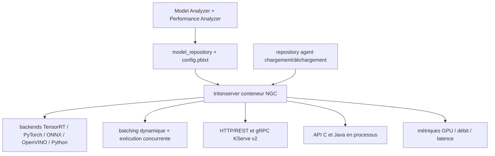

# triton-inference-server/server

> Serveur d'inférence NVIDIA multi-framework pour déployer des modèles en cloud, datacenter ou périphérie.

## Le problème
Chaque framework a son propre serveur d'inférence, donc autant de piles à exploiter que de types de modèles.
Obtenir du débit demande du batching dynamique et de l'exécution concurrente, rarement fournis par défaut.

## Ce que ça fait vraiment
Sert des modèles TensorRT, PyTorch, ONNX, OpenVINO, Python et RAPIDS FIL depuis un même dépôt de modèles.
Exécution concurrente de modèles, batching dynamique, batching de séquences avec gestion d'état implicite pour les modèles à état.
Pipelines par Model Ensemble ou Business Logic Scripting ; backends personnalisés en C/C++ ou Python ; backends découplés (plusieurs réponses, ou aucune, pour une requête).
Protocoles HTTP/REST et gRPC fondés sur KServe v2, API C et Java pour l'intégration en processus, métriques d'utilisation GPU, débit et latence.

## Comment c'est branché


## Essayer
```bash
git clone -b r26.08 https://github.com/triton-inference-server/server.git
cd server/docs/examples
./fetch_models.sh
docker run --gpus=1 --rm --net=host -v ${PWD}/model_repository:/models nvcr.io/nvidia/tritonserver:26.08-py3 tritonserver --model-repository=/models --model-control-mode explicit --load-model densenet_onnx
docker run -it --rm --net=host nvcr.io/nvidia/tritonserver:26.08-py3-sdk /workspace/install/bin/image_client -m densenet_onnx -c 3 -s INCEPTION /workspace/images/mug.jpg
```

## Coût et pièges
Le serveur est ouvert et gratuit ; les images passent par NGC et le support entreprise relève de NVIDIA AI Enterprise, payant.
Piège de version : la branche `main` est en développement, la version publiée est 2.72.0 / conteneur 26.08 — prendre la branche `r26.08`. Tous les backends ne sont pas disponibles sur toutes les plateformes : consulter la matrice de support.

## Ce que ce n'est pas
Pas spécialisé LLM : c'est un serveur d'inférence généraliste, le KV cache et le batching continu ne sont pas son sujet.
Pas dépendant du GPU en théorie — un mode CPU existe — mais tout le README est orienté NVIDIA.
Pas un outil d'optimisation : Model Analyzer et Performance Analyzer sont des outils séparés.

## Alternatives
Aucune alternative nommée ; les dépôts cités (backend, fil_backend, python_backend, kserve) sont des composants.

## Pour toi
Le socle si tu sers des modèles hétérogènes hors LLM ; pour du texte génératif, regarde ailleurs d'abord.
