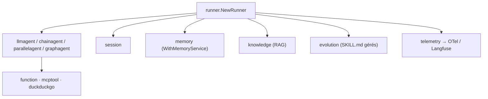

# trpc-group/trpc-agent-go

> Framework Go complet pour bâtir des systèmes d'agents destinés à la production.

## Le problème
Écrire un agent en Go oblige à choisir entre un portage approximatif de LangChain et tout
réécrire : sessions, mémoire, RAG, tracing, évaluation.

## Ce que ça fait vraiment
Rassemble dans une pile Go native les agents LLM, les workflows en graphe, l'appel d'outils,
l'état de session et de mémoire, la récupération de connaissances, l'auto-évolution,
l'évaluation et l'observabilité OpenTelemetry. Le `GraphAgent` offre des workflows typés avec
routage multi-conditionnel, présenté comme l'équivalent fonctionnel de LangGraph pour Go.
Quatre agents prêts à composer : `LLMAgent`, `ChainAgent` (séquentiel), `ParallelAgent`
(concurrent, fusion des résultats), `CycleAgent` (boucle jusqu'à condition d'arrêt). Les
Agent Skills suivent la spécification `SKILL.md` avec exécution isolée. L'auto-évolution
relit les sessions terminées en arrière-plan, extrait des procédures réutilisables, les passe
par des portes de qualité et les republie en skills gérées. Protocoles : AG-UI pour les
frontends, A2A entre agents, MCP pour les outils.

## Comment c'est branché


## Essayer
```bash
git clone https://github.com/trpc-group/trpc-agent-go.git
cd trpc-agent-go
export OPENAI_API_KEY="your-api-key-here"
cd examples/runner
go run . -model="gpt-4o-mini" -streaming=true
go test ./...
go vet ./...
```

## Coût et pièges
Go 1.21+, une clé d'API LLM à ta charge. Deux pièges documentés. D'abord l'annulation : ne
« casse » pas ta boucle d'événements, annule le contexte puis continue à vider le canal
jusqu'à sa fermeture, sinon la goroutine de l'agent peut rester bloquée en écriture. Ensuite
les skills : si tu utilises `WithCodeExecutor` uniquement pour `skill_run`, il faut poser
`llmagent.WithEnableCodeExecutionResponseProcessor(false)`, sinon les blocs de code présents
dans le texte de l'assistant s'exécutent tout seuls.

## Ce que ce n'est pas
Ce n'est pas un produit clé en main : c'est un framework à compiler dans ton service. Ce n'est
pas non plus un portage : l'API est pensée Go (contextes, canaux, annulation). L'exemple de
passerelle « openclaw » est minimal, avec des contrôles de sécurité basiques.

## Alternatives
- ADK, Agno, CrewAI, AutoGen : cités comme sources d'inspiration, tous hors de Go.
- LangGraph, dont `GraphAgent` revendique l'équivalence fonctionnelle.

## Pour toi
Le framework à regarder si tes services de production sont en Go et que tu refuses d'ajouter Python.
