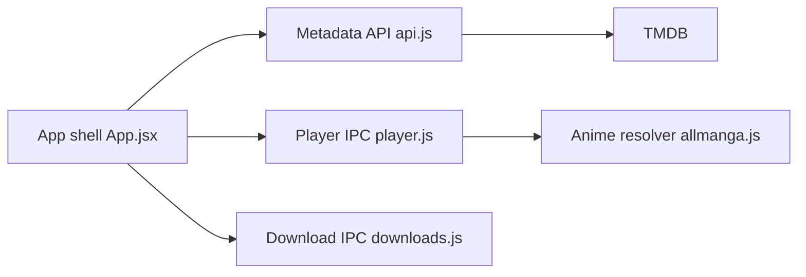

# truelockmc/streambert

> Application Electron de streaming et téléchargement de films, séries et animes depuis des sources tierces.

## Le problème
Regarder et télécharger du contenu vidéo sans publicité depuis une application unique.

## Ce que ça fait vraiment
Récupère des flux via VidSrc, videasy et vidking, et les métadonnées via TMDB (AniList pour les animes). Les animes sont scrappés depuis AllManga. L'app extrait des playlists .m3u8, télécharge avec ffmpeg, gère les sous-titres et une bibliothèque de visionnage.

## Comment c'est branché


## Essayer
```bash
sudo dpkg -i streambert_*.deb
npm install
npm run dist:linux
```

## Coût et pièges
Jeton TMDB gratuit requis au premier lancement ; ffmpeg pour télécharger. Le contenu vient de sites tiers dont les droits ne sont pas garantis : l'utilisateur est seul responsable.

## Ce que ce n'est pas
Pas un service légal de streaming : le README précise qu'il ne fait qu'agréger des sources. L'absence de collecte de données ne couvre pas les sources tierces.

## Alternatives
Cite ani-cli comme origine du mécanisme de scraping des animes.

## Pour toi
À ignorer : risque juridique sur le contenu, aucun rapport avec la data ou l'IA.

