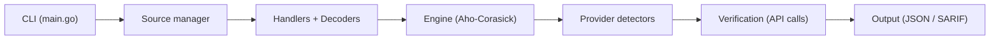

# trufflesecurity/trufflehog

> Scanner de secrets qui détecte, classe et vérifie les identifiants exposés dans dépôts, buckets et images.

## Le problème
Des clés d'API et mots de passe se glissent dans Git, les logs ou les images Docker ; sans vérification, on ne sait pas lesquels sont encore actifs.

## Ce que ça fait vraiment
Sources multiples (git, GitHub, GitLab, S3, GCS, Docker, filesystem, Hugging Face, Jenkins, Elasticsearch, stdin). Le moteur normalise le contenu (archives, décodage), applique plus de 800 détecteurs par Aho-Corasick, puis teste chaque secret contre l'API du fournisseur : verified, unverified ou unknown. Un mode `analyze` interroge les permissions. Sorties texte, JSON, SARIF ; action GitHub, GitLab CI et hook pre-commit.

## Comment c'est branché


## Essayer
```bash
brew install trufflehog
trufflehog git https://github.com/trufflesecurity/test_keys --results=verified
trufflehog filesystem path/to/dir
docker run --rm -it -v "$PWD:/pwd" trufflesecurity/trufflehog:latest github --org=trufflesecurity
```

## Coût et pièges
Gratuit ; produit entreprise en parallèle. La vérification envoie des requêtes réelles aux fournisseurs. Sans jeton, les scans de dépôts GitHub sont limités en débit. Licence AGPL-3.0. Les API Go ne sont pas garanties stables.

## Ce que ce n'est pas
Ce n'est pas un correcteur : il trouve les secrets mais ne les révoque pas. Le local git est cloné dans un dossier temporaire par sécurité.

## Alternatives
- Aucune alternative nommée dans le README.

## Pour toi
Adopter : à mettre en CI et à passer sur tes dépôts de notebooks et images Docker, où les clés fuitent facilement.

