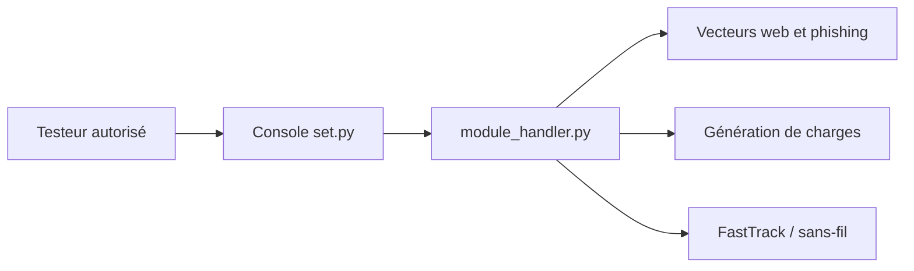

# trustedsec/social-engineer-toolkit

> Framework de test d'intrusion de TrustedSec pour évaluations d'ingénierie sociale autorisées, à usage défensif encadré.

## Le problème
Les équipes de sécurité doivent tester la vigilance des utilisateurs et valider leurs contrôles dans un cadre consenti.

## Ce que ça fait vraiment
Une console interactive Python (`setoolkit`) avec vecteurs guidés. D'après l'architecture tirée du code : modules web et phishing, génération de charges, écouteur, attaques réseau (FastTrack) et sans-fil. Le README insiste sur l'usage réservé aux tests autorisés et renvoie à un manuel utilisateur PDF.

## Comment c'est branché


## Essayer
```bash
sudo apt install set -y
sudo setoolkit
```
Autre voie du README : installation depuis les sources dans un environnement virtuel.

## Coût et pièges
Licence : aucune n'est déclarée dans le catalogue, alors que le README renvoie à `readme/LICENSE` : à vérifier avant toute redistribution. Droits root requis. Usage sans autorisation explicite interdit par le README.

## Ce que ce n'est pas
Ce n'est pas un outil de défense ou de détection. Ce n'est pas utilisable sans cadre légal et périmètre convenu.

## Alternatives
Aucune alternative nommée dans le README.

## Pour toi
À ignorer : outil offensif sans rapport avec un profil data/IA/MLOps, et statut de licence non clarifié dans le catalogue.

