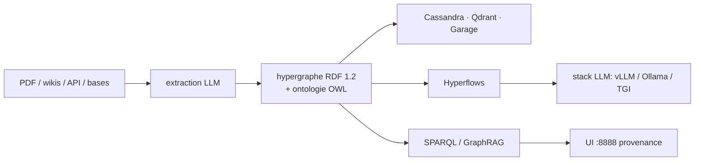

# trustgraph-ai/trustgraph

> Couche d'orchestration de contexte à base d'hypergraphes RDF, pour équipes qui déploient des agents en entreprise.

## Le problème
Deux agents ne peuvent pas communiquer s'ils ne partagent pas la même compréhension du contexte.
Le README le montre avec « Who's on First » : un RAG vectoriel prend « Who » pour un pronom
interrogatif au lieu d'un nom de joueur, et hallucine. La similarité sémantique est probabiliste :
elle ne distingue pas un mot employé comme pronom d'un nom propre dans un contexte local.

## Ce que ça fait vraiment
Ingère PDF, wikis, API et bases, extrait entités et relations par LLM et les structure dans l'hypergraphe.
Utilise RDF 1.2 et les Named Graphs en N-Quads pour référencer une déclaration entière comme nœud,
donc des relations n-aires : un document, son auteur, le manager approbateur, la politique de
conformité et les métadonnées temps/lieu dans une seule unité adressable. Ontologie OWL apportée
par l'utilisateur (BYOO), récupération conforme à l'ontologie automatisée.
Hyperflows : workflows agentiques chaînés, avec LLM et permissions de graphe configurés par étape.
Workspaces (isolation), Collections (bases de connaissances partitionnées), Context Cores (unités
de contexte portables). Provenance temps réel de chaque décision d'agent.

## Comment c'est branché


## Essayer
```bash
npx @trustgraph/config
```

## Coût et pièges
Se déploie en conteneurs Docker, Podman ou Minikube ; le configurateur produit `deploy.zip` avec
`docker-compose.yaml` ou `resources.yaml` et un `INSTALLATION.md`. Trois clés d'API seulement peuvent
être nécessaires : un LLM tiers, un OCR tiers, et celle que tu fixes pour ta passerelle.
Le reste (Cassandra, Qdrant, Garage, Pulsar/RabbitMQ, stack d'inférence) est inclus — donc lourd.
Déploiement auto-hébergé, BYOC ou SaaS managé.

## Ce que ce n'est pas
Ce n'est pas une base graphe : le README insiste, c'est un moteur de traitement.
Ce n'est pas un graphe de connaissances classique limité aux relations binaires.
Ce n'est pas léger : compter une pile complète de services pour un premier essai.

## Alternatives
Glean, cité comme recherche d'entreprise standard, indexation documentaire et similarité vectorielle
là où TrustGraph vise le contexte hyper-relationnel.

## Pour toi
L'argument anti-RAG-vectoriel est solide et bien démontré ; à évaluer si tu as déjà une ontologie métier.
