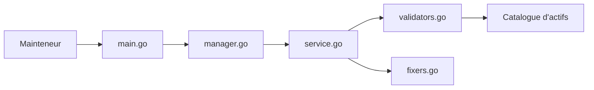

# trustwallet/assets

> Dépôt communautaire de logos et d'informations de milliers de jetons crypto, utilisé par Trust Wallet.

## Le problème
Les données d'un jeton (logo, description) n'existent pas sur la chaîne ; chaque portefeuille devrait les réunir lui-même.

## Ce que ça fait vraiment
Catalogue de fichiers par blockchain : logos et `info.json` de jetons, validateurs de staking, dApps, listes de paires de trading (`tokenlist.json`). Un CLI Go valide et corrige l'ensemble (`make check`, `make fix`, `make update-auto`). Les jetons neufs ou à circulation minimale sont refusés.

## Comment c'est branché


## Essayer
```bash
make check
make fix
make add-token asset_id=c60_t0x4Fabb145d64652a948d72533023f6E7A623C7C53
```

## Coût et pièges
Gratuit. L'ajout passe par l'application web Assets (compte GitHub requis) et des vérifications automatiques. L'équipe se réserve le droit de rejeter tout actif jugé frauduleux.

## Ce que ce n'est pas
Pas une source de prix ni de données de marché : seulement logos et métadonnées. Y figurer n'implique pas un partenariat avec Trust Wallet.

## Alternatives
Aucune alternative nommée dans le README.

## Pour toi
Ignorer : base de logos crypto, utile seulement pour un projet de portefeuille ou d'analyse on-chain.

