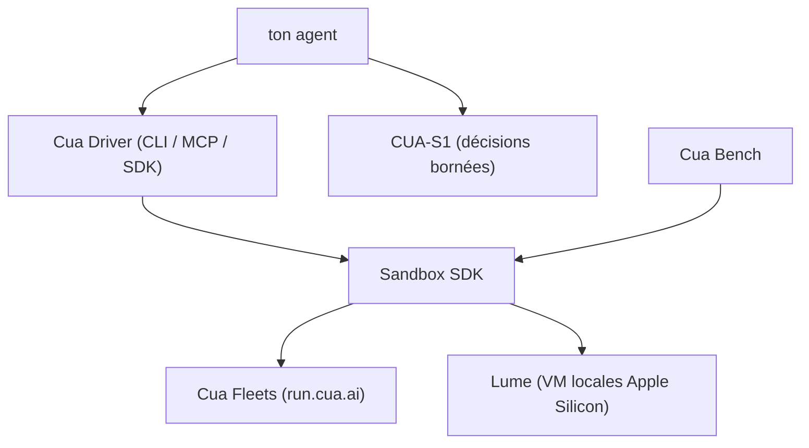

# trycua/cua

> Boîte à outils pour faire piloter à un agent de vrais bureaux, locaux ou en nuage.

## Le problème
Un agent qui doit cliquer dans une application n'a ni machine, ni isolation, ni moyen de vérifier
que l'écran affiche bien le résultat attendu.

## Ce que ça fait vraiment
Cinq briques. Cua Fleets provisionne des bureaux Linux isolés sur `run.cua.ai`, réclamés depuis un
pool via le Sandbox SDK. Cua Driver donne à l'agent des outils pour inspecter et piloter des
applications natives et des navigateurs sur macOS, Windows et Linux, via CLI, MCP ou SDK typés.
CUA-S1 est une famille de petits modèles spécialisés dans les décisions bornées (le premier profil
porte sur les formulaires). Lume crée des VM macOS et Linux sur Apple Silicon. Cua Bench construit
des tâches d'évaluation et exporte des trajectoires.

## Comment c'est branché


## Essayer
```bash
/bin/bash -c "$(curl -fsSL https://cua.ai/driver/install.sh)"
/bin/bash -c "$(curl -fsSL https://cua.ai/lume/install.sh)"
uv tool install 'cua-bench[browser]'
uv tool run --from 'cua-bench[browser]' playwright install chromium
```

## Coût et pièges
Les Fleets sont du cloud payant, et le README prévient : un pool peut conserver de la capacité
facturée après la fin d'une réclamation — il faut suivre les étapes de nettoyage. Lume exige du
matériel Apple Silicon. Cua Bench demande Python 3.12 ou 3.13 et `uv`.

## Ce que ce n'est pas
Pas un agent : « apportez votre agent et votre modèle », Cua fournit la machine et les outils.
CUA-S1 n'est pas un remplaçant de la planification d'un agent généraliste, et sa publication GitHub
est une sortie de recherche sans poids (les poids sont sur Hugging Face, avec leurs propres licences).
Les sandbox locaux et les Fleets ne partagent ni identifiants, ni images, ni contraintes d'exécution.

## Alternatives
- Lume : l'option locale, si les bureaux ne doivent pas quitter ta machine.

## Pour toi
À regarder seulement si tu évalues des agents computer-use ; sinon la surface de dépendance est disproportionnée.
