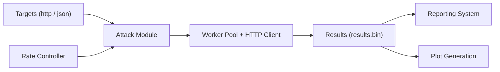

# tsenart/vegeta

> Outil de test de charge HTTP à débit constant, en ligne de commande et en bibliothèque Go.

## Le problème
Pour mesurer la latence d'un service sous charge, un débit constant est nécessaire ; sinon la lenteur du serveur fausse la mesure (coordinated omission).

## Ce que ça fait vraiment
La commande `attack` envoie des requêtes à un débit fixé (`-rate`, `-duration`) vers des cibles lues en format http ou JSON, avec HTTP/2, TLS client, DNS personnalisé et exporteur Prometheus. Les résultats binaires passent par `report` (texte, JSON, histogramme, hdrplot), `plot` (HTML) ou `encode` (csv, gob, json), en composition Unix. Le mode distribué consiste à lancer l'attaque sur plusieurs machines et fusionner les fichiers.

## Comment c'est branché


## Essayer
```bash
brew update && brew install vegeta
echo "GET http://localhost/" | vegeta attack -duration=5s | tee results.bin | vegeta report
cat results.bin | vegeta plot > plot.html
vegeta report -type=json results.bin > metrics.json
```

## Coût et pièges
Gratuit. Limites de descripteurs de fichiers et de mémoire à ajuster (`ulimit`). Avec `-rate=0` et beaucoup de workers, il peut saturer la machine. Les horodatages Prometheus sont ceux du scrape, donc imprécis. Le diagramme d'architecture fourni est absent.

## Ce que ce n'est pas
Ce n'est pas un outil de test fonctionnel ni de scénarios navigateur : il ne fait que du HTTP à débit donné. Dernier push le 2026-02-16.

## Alternatives
- Aucune alternative nommée dans le README.

## Pour toi
Adopter : simple et scriptable pour mesurer latence et débit d'un endpoint d'inférence ou d'une API de modèle avant mise en production.

