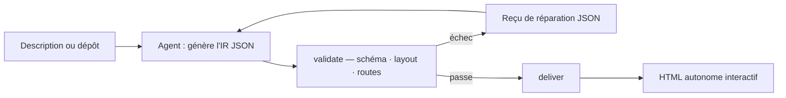

# tt-a1i/archify

> Skill d'agent qui transforme une description ou un dépôt en diagramme HTML interactif.

## Le problème
Expliquer une architecture suppose un diagramme ; les outils de dessin demandent du temps, et un export figé ne se parcourt pas.

## Ce que ça fait vraiment
L'agent produit un IR JSON typé, que des validateurs vérifient (schéma, layout, HTML/SVG, routes, dégagement des libellés) avant livraison ; un échec renvoie un « reçu de réparation » JSON avec le code de règle et les correctifs supportés. Cinq types : Architecture, Workflow, Sequence, Data Flow, Lifecycle. Sortie : un fichier HTML autonome avec focus, reach amont/aval, routes, chapitres guidés, exports PNG/vidéo/share card. Un mode `preview` en loopback surveille un fichier et ne recharge que les révisions validées.

## Comment c'est branché


## Essayer
```bash
npx skills add tt-a1i/archify -g
node bin/archify.mjs doctor
node bin/archify.mjs deliver workflow examples/agent-tool-call.workflow.json /tmp/workflow.html --quality showcase --json
```

## Coût et pièges
Gratuit. Une requête GET vers un manifeste stable peut afficher un rappel de mise à jour ; `ARCHIFY_UPDATE_CHECK_DISABLED=1` la coupe. Le serveur ne voit que l'IP et l'heure, jamais le contenu.

## Ce que ce n'est pas
Ni éditeur de dessin généraliste, ni thème Mermaid. Le parsing Mermaid automatique, l'auto-layout générique, le partage hébergé et l'édition WYSIWYG sont hors périmètre assumé. Les diagrammes n'infèrent aucun impact runtime.

## Alternatives
Aucune alternative nommée dans le README.

## Pour toi
À surveiller : intéressant pour documenter un pipeline data en un HTML partageable, mais dépôt jeune porté par une personne.
