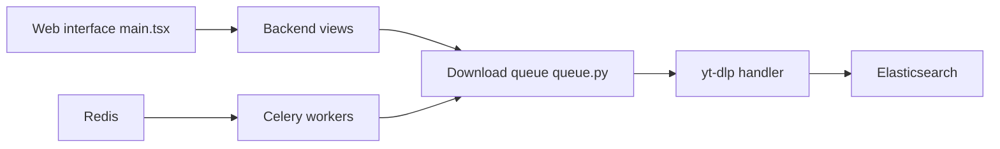

# tubearchivist/tubearchivist

> Archive YouTube auto-hébergée : abonnements, téléchargement yt-dlp, indexation et lecture hors ligne.

## Le problème
Une collection de vidéos YouTube devient impossible à chercher ; les vidéos peuvent disparaître.

## Ce que ça fait vraiment
S'abonne à des chaînes, télécharge avec yt-dlp, indexe métadonnées et commentaires dans Elasticsearch, et sert une interface web de recherche et de lecture. Redis et Celery gèrent les tâches planifiées. Il suit les vidéos vues ou non.

## Comment c'est branché


## Essayer
```bash
sudo sysctl -w vm.max_map_count=262144
```
Puis partir de l'exemple `docker-compose.yml` du dépôt, renseigner `TA_HOST`, `TA_USERNAME`, `TA_PASSWORD`, `ELASTIC_PASSWORD`, `REDIS_CON`, `TZ`.

## Coût et pièges
2 à 4 Go de RAM, Docker, Elasticsearch et Redis obligatoires ; l'espace disque doit rester sous 95 %. Les mises à jour peuvent casser (lire les release notes).

## Ce que ce n'est pas
Pas un client léger : il dépend de yt-dlp et en hérite les limites. Nommage des fichiers non configurable.

## Alternatives
Aucune alternative nommée dans le README (plugins Jellyfin/Plex cités comme compléments).

## Pour toi
À surveiller : utile pour archiver du contenu pédagogique ou des talks, mais sans lien direct avec le travail data/IA et coûteux en ressources.

