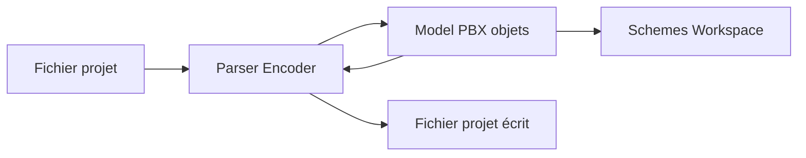

# tuist/XcodeProj

> Bibliothèque Swift pour lire, modifier et écrire les fichiers de projets Xcode.

## Le problème
Modifier un `project.pbxproj` à la main ou par script est fragile.

## Ce que ça fait vraiment
Charge un `.xcodeproj` en graphe d'objets (`PBXProj`), permet de le modifier, puis le réécrit. Supporte aussi, de façon expérimentale, le format JSON `project.xcproj` introduit par Xcode 27.2, avec conversion par argument. Gère schémas, workspaces et références de packages Swift.

## Comment c'est branché


## Essayer
```bash
scripts/set-project-version ./App.xcodeproj 1.2.3
```
Dépendance SwiftPM : `.package(url: "https://github.com/tuist/XcodeProj.git", .upToNextMajor(from: "8.12.0"))`.

## Coût et pièges
Gratuit. Le support du format JSON est expérimental : à vérifier avant commit.

## Ce que ce n'est pas
Pas un outil en ligne de commande : c'est une bibliothèque pour scripts et outils. Elle ne compile rien.

## Alternatives
Le README cite ProjLint, Tuist, XcodeGen et Sourcery comme projets qui l'utilisent.

## Pour toi
À ignorer : outillage iOS sans rapport avec données ou MLOps.

