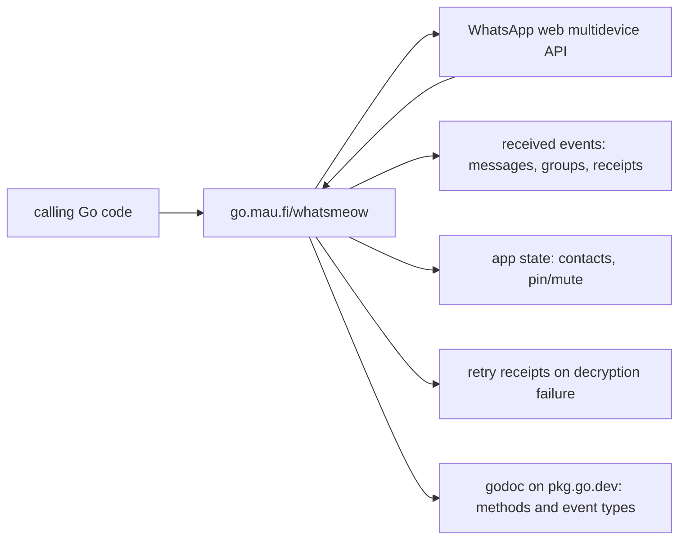

# tulir/whatsmeow

> **A Go library for the WhatsApp web multidevice API, to build your own clients.**

## The problem

Without it, talking to WhatsApp from code means reimplementing the web multidevice protocol
yourself: encryption, receipts, app state, group events. The README does not spell out that
context; it simply states which features are covered.

## What it actually does

The README lists the features described as already present: sending messages to private chats
and groups (both text and media), receiving all messages, managing groups and receiving group
change events, joining via invite messages, using and creating invite links, sending and
receiving typing notifications, sending and receiving delivery and read receipts, reading and
writing app state (contact list, chat pin/mute status), sending and handling retry receipts
when message decryption fails, and sending status messages — this last one labelled
experimental and possibly failing for large contact lists.

## How it is wired

No code-derived diagram exists for this repository; the graph below is reconstructed from the
README sections and names no real files.



## Trying it

```
# no install or run command is documented in the README
```

The README points to the godoc at `pkg.go.dev/go.mau.fi/whatsmeow`, which documents all
methods and event types and carries a simple example at the top of the page.

## Cost and gotchas

The README mentions no API key, no paid service and no hardware requirement. The gotchas it
states itself: status messages are experimental and may not work for large contact lists;
broadcast list messages and calls are not implemented. The undocumented cost is the protocol
itself — protocol questions are routed to a GitHub discussions Q&A category and a Matrix room.

## What it is not

It is not a ready-to-use WhatsApp client nor a hosted service: it is a library you call from
Go. It is not full WhatsApp coverage either — the README explicitly excludes broadcast lists
(unsupported on WhatsApp web as well) and calls. Nothing in the README claims official support
or any guarantee from WhatsApp.

## Alternatives

No comparable alternative in the catalogue: the suggested neighbours (restic/restic,
avelino/awesome-go, iptv-org/iptv, rclone/rclone) deal with backup, resource lists or file
transfer, and none addresses the WhatsApp protocol. The README names no competing project.

## Why it matters to you

Limited relevance for a data / AI / MLOps profile, except in one case: wiring an agent or a
pipeline onto WhatsApp messaging, accepting that you will write Go. Otherwise, skip it.
