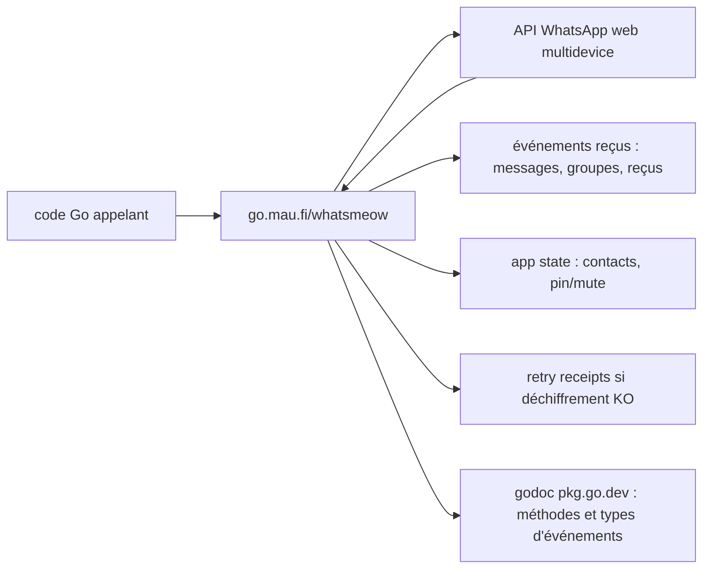

# tulir/whatsmeow

> **Une bibliothèque Go qui parle l'API WhatsApp web multidevice, pour écrire ses propres clients.**

## Le problème

Sans elle, parler à WhatsApp depuis du code signifie réimplémenter soi-même le protocole web
multidevice : chiffrement, reçus, app state, événements de groupe. Le README ne décrit pas ce
contexte, il se contente d'annoncer la couverture fonctionnelle atteinte.

## Ce que ça fait vraiment

Le README liste les fonctions « déjà présentes » : envoi de messages en privé et en groupe
(texte et média), réception de tous les messages, gestion des groupes et réception des
événements de changement, adhésion via messages d'invitation, usage et création de liens
d'invitation, notifications de saisie, accusés de livraison et de lecture, lecture et écriture
de l'app state (liste de contacts, épinglage/silence des chats), envoi et traitement des
retry receipts quand le déchiffrement d'un message échoue, et envoi de messages de statut —
ce dernier point annoncé expérimental et pouvant ne pas fonctionner sur de grandes listes de
contacts.

## Comment c'est branché

Aucun diagramme tiré du code n'existe pour ce dépôt ; le schéma ci-dessous est reconstruit
depuis les rubriques du README, sans noms de fichiers réels.



## Essayer

```
# aucune commande d'installation ni d'exécution n'est documentée dans le README
```

Le README renvoie au godoc `pkg.go.dev/go.mau.fi/whatsmeow`, qui contient la documentation de
toutes les méthodes et types d'événements, ainsi qu'un exemple simple en tête de page.

## Coût et pièges

Le README n'annonce ni clé d'API, ni service payant, ni prérequis matériel. Les pièges qu'il
signale lui-même : les messages de statut sont expérimentaux et peuvent échouer sur de grandes
listes de contacts ; les messages de listes de diffusion et les appels ne sont pas implémentés.
Le coût réel non documenté ici est celui du protocole lui-même — les questions de protocole
sont renvoyées vers une section Q&A des discussions GitHub et un salon Matrix.

## Ce que ce n'est pas

Ce n'est pas un client WhatsApp prêt à l'emploi ni un service hébergé : c'est une bibliothèque
qu'on appelle depuis du Go. Ce n'est pas non plus une couverture complète de WhatsApp — le
README exclut explicitement les listes de diffusion (non supportées sur WhatsApp web non plus)
et les appels. Rien dans le README ne parle de support officiel ni de garantie de la part de
WhatsApp.

## Alternatives

Aucune alternative comparable dans le catalogue : les voisins proposés (restic/restic,
avelino/awesome-go, iptv-org/iptv, rclone/rclone) relèvent de la sauvegarde, des listes de
ressources ou du transfert de fichiers, et aucun ne s'adresse au protocole WhatsApp. Le README
ne nomme aucun projet concurrent.

## Pour toi

Intérêt limité pour un profil data / IA / MLOps, sauf cas précis : brancher un agent ou un
pipeline sur de la messagerie WhatsApp, en assumant d'écrire du Go. Sinon, passer son chemin.
