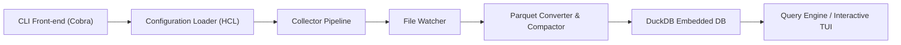

# turbot/tailpipe

> CLI qui collecte des journaux cloud dans Parquet et les interroge en SQL avec DuckDB, en local.

## Le problème
Interroger des journaux cloud (CloudTrail…) exige un entrepôt distant ou des scripts ad hoc.

## Ce que ça fait vraiment
`tailpipe collect` télécharge et enrichit les journaux d'une source (plugin AWS, Azure, GCP) et les écrit en Parquet ; `tailpipe query` ouvre un mode SQL interactif sur DuckDB. La configuration se fait en HCL (connexions, partitions, sources). Des benchmarks et détections prêts à l'emploi (MITRE ATT&CK) existent via Powerpipe.

## Comment c'est branché


## Essayer
```bash
brew install turbot/tap/tailpipe
tailpipe plugin install aws
tailpipe collect aws_cloudtrail_log
tailpipe query
```

## Coût et pièges
Identifiants cloud pour chaque source ; les plugins se téléchargent depuis un registre OCI. Licence AGPL-3.0. La version affichée dans le README est 0.1.0 ; 39 issues ouvertes.

## Ce que ce n'est pas
Pas un SIEM ni un service hébergé : tout tourne sur votre machine. Les détections passent par un outil séparé, Powerpipe.

## Alternatives
Aucune alternative citée ; Powerpipe est un complément, pas un substitut.

## Pour toi
À surveiller : SQL local sur des journaux, utile pour l'analyse et la sécurité ; la licence AGPL est à vérifier avant tout usage dans un produit.
