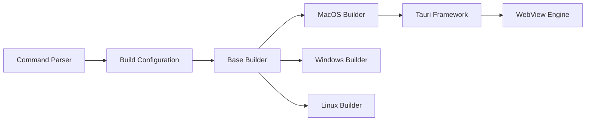

# tw93/Pake

> CLI qui emballe un site web en appli de bureau légère via Rust Tauri.

## Le problème
Transformer un site en appli native avec Electron produit des paquets lourds et gourmands en mémoire.

## Ce que ça fait vraiment
`pake <url> --name X` génère une appli Mac/Windows/Linux avec icône récupérée, taille de fenêtre, barre de titre masquée.
Raccourcis de navigation, injection de CSS/JS, fenêtre immersive.
Mode `--json` et `--config app.json` pour piloter depuis un script ou un agent ; paquets tout faits (ChatGPT, YouTube…) en Releases.
Build en ligne via GitHub Actions possible.

## Comment c'est branché


## Essayer
```bash
pnpm install -g pake-cli
pake https://github.com --name GitHub
pnpm i
pnpm run dev
```

## Coût et pièges
Premier packaging lent (mise en place de l'environnement) ; développement local : Rust ≥ 1.85 et Node ≥ 22.

## Ce que ce n'est pas
Pas un framework d'appli : juste un conteneur WebView autour d'un site. GPL-3.0. Le diagramme d'architecture fourni est générique, pas tiré du code.

## Alternatives
Non documenté : Electron est cité comme comparaison, sans dépôt nommé.

## Pour toi
Hors périmètre data/IA ; gadget utile pour épingler un outil web, rien de plus.
