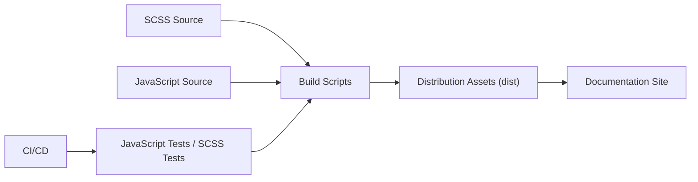

# twbs/bootstrap

> Framework front-end de composants CSS et JavaScript pour interfaces web réactives, destiné aux développeurs web.

## Le problème
Écrire à la main une interface responsive cohérente coûte du temps : grille, formulaires, boutons, modales.

## Ce que ça fait vraiment
Bootstrap 5 fournit du CSS compilé (grille, reboot, utilitaires, versions RTL et minifiées) et du JavaScript de composants (les bundles incluent Popper). Les sources sont en SCSS et JS, compilées par des scripts de build (Rollup, PostCSS) vers `dist`. La documentation est construite avec Astro (le graphe parle de Hugo, contradiction avec le README, qui prévaut).

## Comment c'est branché


## Essayer
```bash
npm install bootstrap@v5.3.8
yarn add bootstrap@v5.3.8
composer require twbs/bootstrap:5.3.8
git clone https://github.com/twbs/bootstrap.git
npm run docs-serve
```

## Coût et pièges
Gratuit. La branche par défaut est Bootstrap 5 ; Bootstrap 4 est sur `v4-dev`. Pour la doc en local, il faut d'abord `npm install`, puis `npm run test` pour reconstruire les assets.

## Ce que ce n'est pas
Pas un framework JavaScript applicatif : pas de gestion d'état ni de routage. Ce n'est pas non plus un système de design personnalisable clé en main.

## Alternatives
Aucune alternative nommée dans le README.

## Pour toi
À ignorer : utile seulement si tu habilles à la main un front web ; un profil data/IA passera plutôt par un outil de dashboard.

