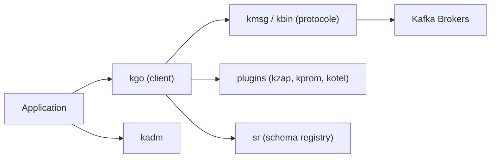

# twmb/franz-go

> Client Apache Kafka complet écrit en Go pur, pour équipes qui produisent et consomment des flux.

## Le problème
Les clients Kafka Go sont souvent partiels ou enveloppent une bibliothèque C.

## Ce que ça fait vraiment
Il couvre Kafka de 0.8.0 à 4.4+, avec transactions et exactly-once, producteurs idempotents, groupes de consommateurs (dont KIP-848), groupes de partage, compressions et SASL. Des paquets annexes fournissent l'administration (`kadm`), un client de registre de schémas (`sr`) et des plugins de métriques et de logs. Il fonctionne avec Redpanda, Confluent, Event Hubs et MSK.

## Comment c'est branché


## Essayer
```bash
go get github.com/twmb/franz-go
go get github.com/twmb/franz-go/plugin/kzap
go get github.com/twmb/franz-go/pkg/kadm
```
Puis `kgo.NewClient(kgo.SeedBrokers(...), kgo.ConsumerGroup(...), kgo.ConsumeTopics(...))`.

## Coût et pièges
Gratuit. Il faut un cluster Kafka. Event Hubs n'accepte pas la compression à la production. Recréer un topic avec un client vivant est déconseillé.

## Ce que ce n'est pas
Pas un broker ni un outil d'analyse de flux. Il ne fournit pas de traitement de flux type Kafka Streams.

## Alternatives
Aucune alternative nommée dans le README.

## Pour toi
À adopter si tu alimentes des pipelines de données en Go : complet et suivi de près par l'auteur, avec des utilisateurs cités.

