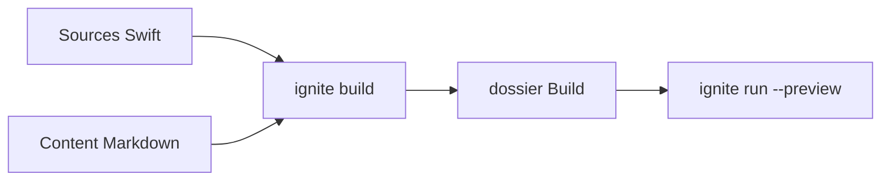

# twostraws/Ignite

> Générateur de sites statiques en Swift à syntaxe proche de SwiftUI, pour développeurs Apple.

## Le problème
Bâtir un site web quand on ne connaît que Swift oblige à apprendre HTML et CSS.

## Ce que ça fait vraiment
Tu décris des pages en Swift (`Text`, `Link`, `Accordion`, `Dropdown`, `CodeBlock`…) dans un package Swift. Le CLI `ignite` crée un projet, construit le dossier `Build` et lance un serveur de prévisualisation. Les fichiers Markdown de `Content` sont rendus via des layouts conformes à `ArticlePage`. Coloration syntaxique pour une douzaine de langages.

## Comment c'est branché
Pas de composant lisible fourni par le diagramme ; schéma déduit du README.


## Essayer
```bash
git clone https://github.com/twostraws/Ignite
cd Ignite
make
make install
ignite new ExampleSite
cd ExampleSite
ignite build
ignite run --preview
```

## Coût et pièges
Gratuit ; toolchain Swift requise (Xcode plutôt côté macOS).

## Ce que ce n'est pas
Ne convertit pas du SwiftUI en HTML : c'est une API inspirée de SwiftUI. Ne se prévisualise pas en ouvrant le HTML dans le navigateur.

## Alternatives
Aucune alternative nommée dans le README.

## Pour toi
À ignorer : utile seulement si tu écris déjà du Swift ; pour un site de projet data, un générateur plus courant suffit.

