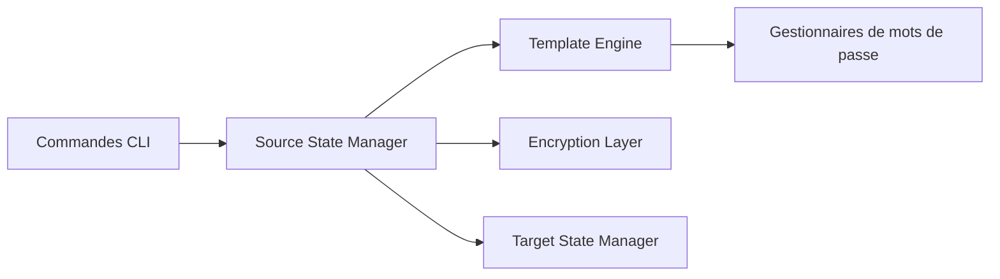

# twpayne/chezmoi

> Gestionnaire de dotfiles pour plusieurs machines, de façon sécurisée.

## Le problème
Garder la même configuration de shell et d'outils sur plusieurs machines différentes, sans exposer les secrets.

## Ce que ça fait vraiment
Le README tient en trois lignes et renvoie à chezmoi.io. D'après le descriptif d'architecture (déduit de l'arborescence, non vérifié dans le code), il sépare l'état source de l'état cible, traite des modèles, chiffre via age ou gpg et lit des gestionnaires de mots de passe (1Password, Bitwarden, LastPass, KeePassXC). Il est écrit en Go.

## Comment c'est branché

## Essayer
Aucune commande documentée dans le README (renvoi à chezmoi.io).

## Coût et pièges
Gratuit. Le README ne dit rien de l'installation ni des prérequis ; tout est dans la documentation externe.

## Ce que ce n'est pas
Ce n'est pas un outil de gestion de configuration de serveurs. Fiche minimale : le README seul ne permet pas d'en dire plus.

## Alternatives
Aucune alternative citée dans le README.

## Pour toi
Surveiller : utile si tu jongles entre laptop, poste GPU et serveurs, mais le verdict s'appuie sur la doc externe, pas sur ce README.

