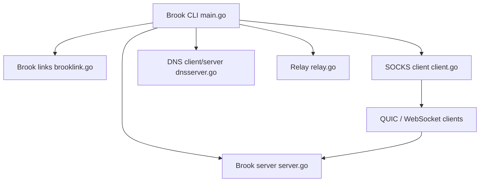

# txthinking/brook

> Outil réseau multiplateforme en Go : serveur, client et relais pour acheminer du trafic via un proxy.

## Le problème
Faire transiter le trafic réseau d'une machine ou d'un appareil par un serveur choisi, avec un client disponible sur chaque système.

## Ce que ça fait vraiment
Un binaire unique, piloté en ligne de commande, qui joue plusieurs rôles : serveur et client proxy (SOCKS), relais direct ou via Brook, services DNS (DNS, DoH, DHCP). D'après le code, le transport passe par TCP/UDP avec cadrage de flux et de paquets, ou par QUIC et WebSocket. Des liens `brook link` servent à personnaliser les paramètres. Le README mentionne des scripts et des plugins réseau (galerie sur brook.app), sans détail ; des clients existent pour iOS, Android, macOS, Windows, Linux et OpenWrt.

## Comment c'est branché


## Essayer
```bash
bash <(curl https://bash.ooo/nami.sh)
nami install brook
brook server -l :9999 -p hello
```

## Coût et pièges
Gratuit ; il faut un serveur à soi pour le côté serveur. Le README cite un sponsor (Shiliew) et la documentation est externe (txthinking.com). Le script d'installation est exécuté directement depuis une URL : à relire avant usage.

## Ce que ce n'est pas
Pas un VPN clé en main ni un service hébergé. Outil à double usage (confidentialité réseau, mais aussi contournement de filtrages) : son usage doit respecter la loi du pays et les règles du réseau concerné.

## Alternatives
Le README ne cite aucune alternative ; non documenté.

## Pour toi
À surveiller : utile pour relayer du trafic ou tester des chemins réseau, mais éloigné du travail data/MLOps courant, et le mainteneur est unique.

