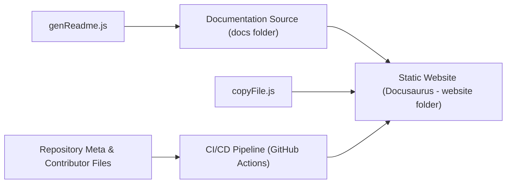

# typescript-cheatsheets/react

> Aide-mémoire pour typer des applications React avec TypeScript, avec exemples à copier.

## Le problème
Typer hooks, refs, contexte et événements React demande de mémoriser beaucoup de cas particuliers.

## Ce que ça fait vraiment
Un README long qui couvre : composants fonction et classe, hooks (useState, useReducer, useRef, useImperativeHandle…), props, formulaires et événements, contexte, refs (dont le ref-prop de React 19), portails, error boundaries et React concurrent. Le contenu est aussi publié en site Docusaurus.

## Comment c'est branché

Le texte d'architecture est un guide de dessin ; l'hébergement Netlify y est déduit.

## Essayer
```bash
npx create-next-app@latest --ts
npx create-remix@latest
npm init gatsby --ts
npx create-expo-app -t with-typescript
npm create vite@latest my-app -- --template react-ts
```

## Coût et pièges
Gratuit. Les conseils changent avec les versions de React et TypeScript (React 19, TS 5.1) : lire la version citée avant d'appliquer un exemple.

## Ce que ce n'est pas
Ce n'est ni une bibliothèque ni une formation : c'est un aide-mémoire opiniâtre qui suppose déjà React et TypeScript de base.

## Alternatives
Aucune alternative nommée dans le README.

## Pour toi
À surveiller : marque-page utile si tu construis un front React pour un outil d'IA, sans intérêt sinon.

